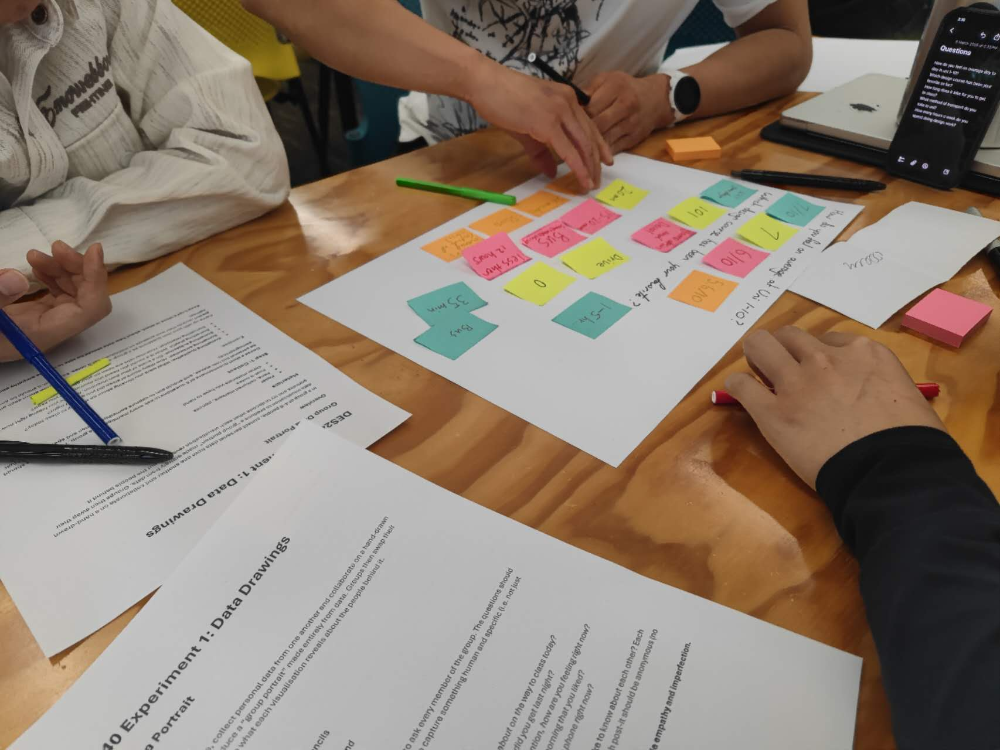
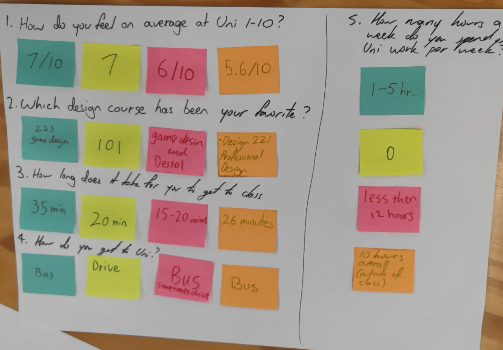
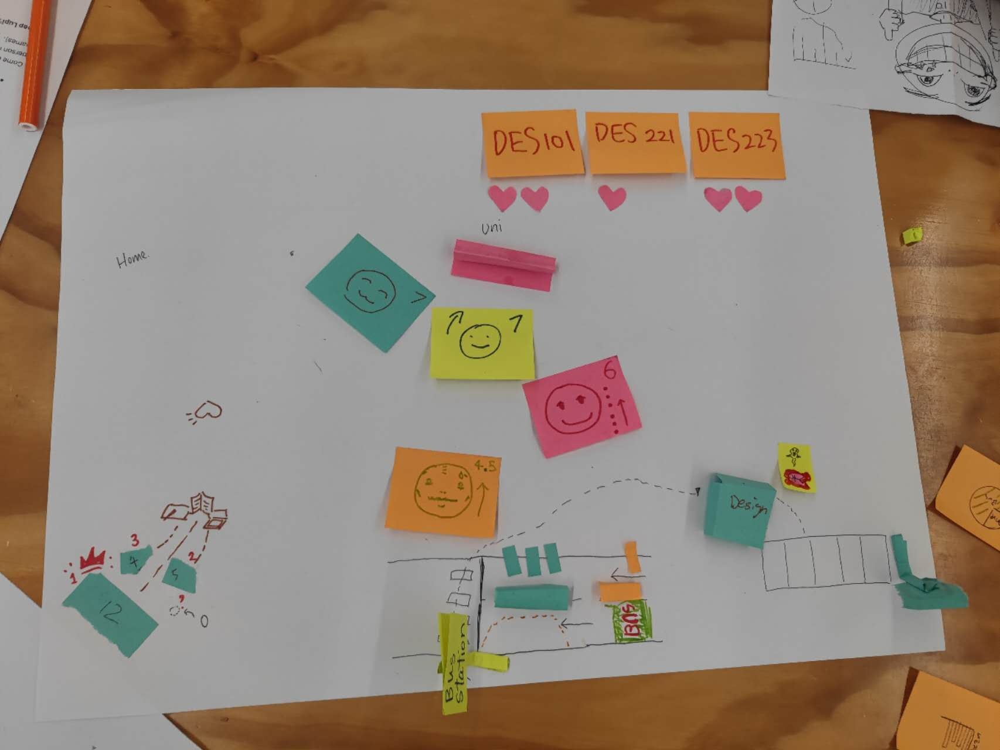
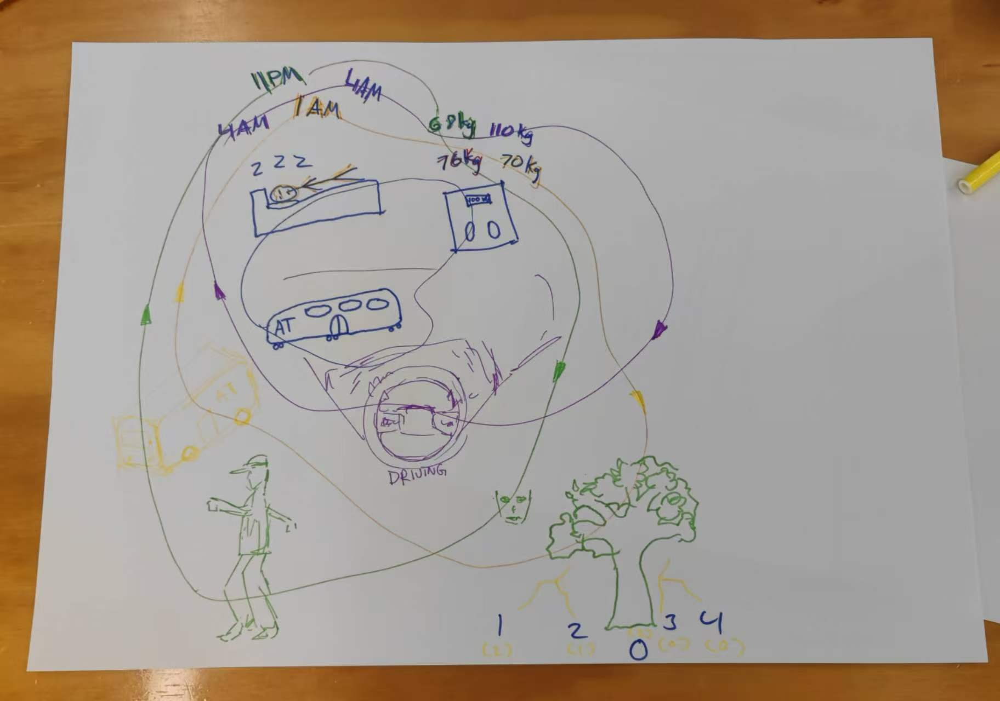
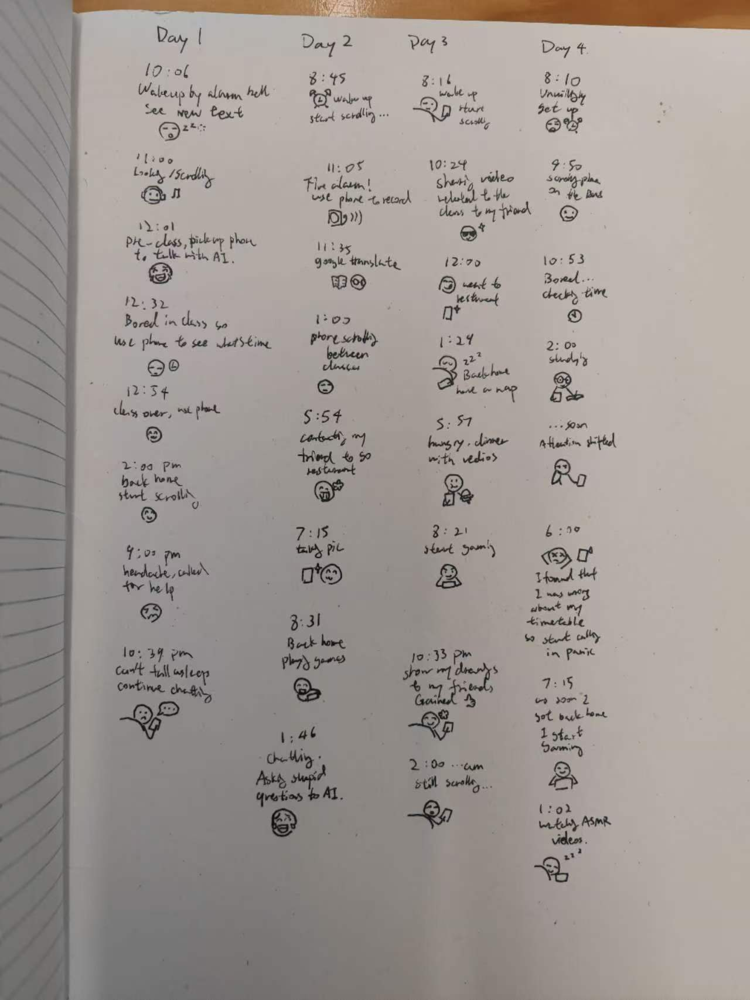
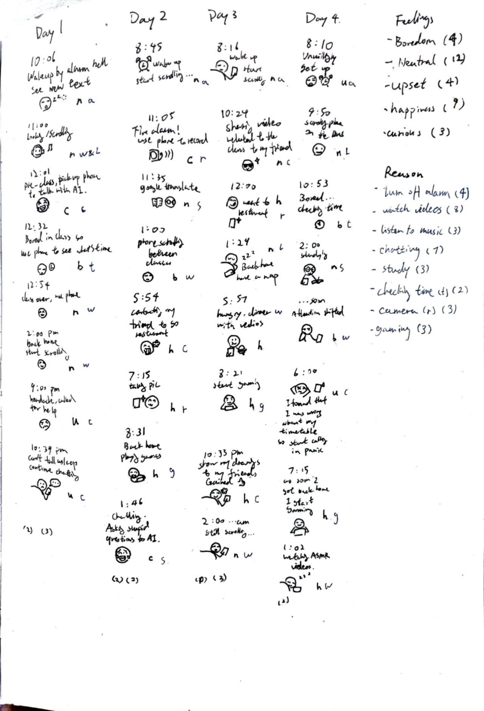
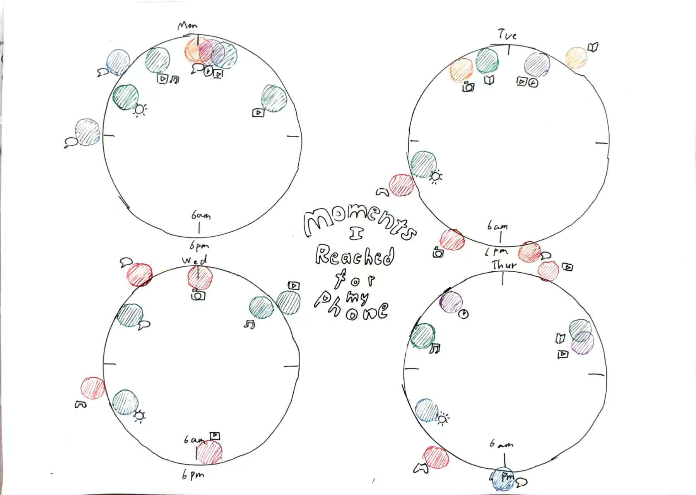
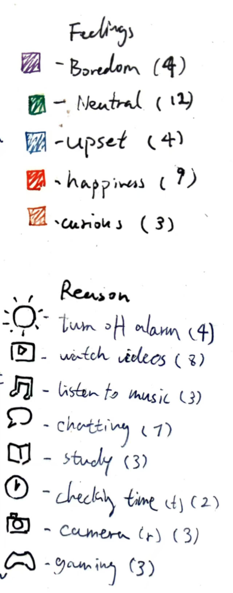

# Week 01

[← Back to Home](../index.md)

## Documentation 

*Include your documentation for the week. Devise your own structure of headings relevant to the required tasks and your process.*

# DES240 Experiment 1: Data Drawings

## Group Data Portrait

*Group data portrait*

### Overview

In group of 4 people, we collected personal data from one another and collaborate on a hand-drawn data visualisation to produce a “group portrait” made entirely from data. Groups then swap their portraits and try to decode what each visualisation reveals about the people behind it.

### Materials

- Paper
- Pens, coloured markers, pencils
- Post-it notes

### Step 1: Collect

We devised a short questionnaire of 5 questions to ask every member of the group. The questions are personal but low-stakes, and aim to capture something human and specific.

*Our Questionnaire data collection board*

Questions:

1 - *How do you feel on average at Uni from 1-10?*
2 - *Which design course has been your favourite?*
3 - *How long does it take for you to get to class?*
4 - *How do you get to Uni?*
5 - *How many hours a week do you spend Uni work per week?*

Each person recorded their own answers on a individual post-it notes. 

### Step 2: Visualise

We collected data, and make data visualisation on paper.

*Our data visualisation board*

We used our own visual language, inventing position, spatial arrangements and colors and even paper folding to encode our data.

We used different color to distinguish one person from another, and the left part indicate home, the right part indicate the uni and design department, because position like this link up our questions.

Our creations capture the vividness and communicate more information than a spreadsheet. For example, the heart shaped dots means the "like" for the course we choosed; the area of the green-blue paper on the left corner means the time we spent on our Uni work per week; the green-blue and orange little block on the right corner means the bus and the car (different ways we get to class) and the small rectangle means the number of people use this way of traffic (three by bus, one by car).

### Step 3: Decode

We swaped data portrait with another group and examined the visualisation we have received.

*Another group's data portrait*

We learned about the family structure and relationships of their families of this group from their data portrait; the weight of the group members; what time of the people in this group go to bed and the way they get to school (two buses means two people by bus, with one driving and one on foot).

I am surprised about the way how they linked all data together by lines and arrows and distinguish them using different colors, because our data collection didn't think about the linkness between the questions, and shows which people is which color directly, so we can always tell who is who. I think our data set is too abstract to tell who is who.

Our question for them are:
- why sleeping at 4 am?
- If you could choose, would you want more or less siblings?
- How do you came up with the idea of a family tree?
- What do you think about these icons you made for the question?
- Which aspect of your data presentation do you think you do best?

## Independent Data Portrait

### Overview

This task explores why I use my phone throughout the day, and how I feel at the moment I pick it up. Over four days, I recorded each instance of phone use by hand in my notebook, noting the time, the reason for using my phone, and my emotional state at that moment. I used small stickman sketches and symbols to show the feelings and activities as they occurred. This dataset became the basis for a personal data drawing that reflects patterns in my everyday behaviour and emotions.

### Step 1: Choose a topic

I chose to track the moments when I pick up my phone and the emotions associated with those moments. Phones are deeply embedded in daily life, yet many interactions with them happen almost automatically and without much reflection. By recording each instance over several days, I wanted to better understand the different motivations behind my phone use, such as boredom, communication, study, or relaxation. Tracking the emotional context also allowed me to observe how my phone use relates to my mood throughout the day.

### Step 2: Collect data by hand

*My data collection*

To collect the data, I just used the last page of my notebook, and recorded each moment when I picked up my phone over four days. Each entry includes the time, the reason I used my phone, and a simple drawing to represent my emotional state at that moment. Because many interactions with phones happen quickly and almost automatically, I tried to record the information as soon as possible after each interaction so the details would remain accurate.

Small icons and facial expressions were used to quickly capture moods such as boredom, happiness, stress, or relaxation. This method allowed me to record data efficiently without interrupting my daily activities too much. Over time, the notebook began to reveal patterns in when and why I used my phone, particularly during moments of boredom, study breaks, or late at night.

*I compiled statistics on various emotions and reasons for use.*

### Step 3: Design your visualisation 

*Moments I Reached for My Phone*

*Note: The inside of the clock represents the time before 6 PM, and the outside represents the time after 6 PM.*

After collecting the data, I translated the observations into a visual system that represents phone interactions over time. I chose a circular layout for each day because it resembles a clock and naturally reflects the cyclical rhythm of a 24-hour day. The inner side of the clock represents the time before 6 PM, and the outside represents the time after 6 PM. Each circle represents one day (from Monday to Thursday), with events placed around the circumference according to the approximate time they occurred. This allows patterns of phone use throughout the day to become visually noticeable.

Color is used to represent emotional states when reaching for the phone. Different colors correspond to feelings such as boredom, neutrality, happiness, upset, and curiosity. This color coding makes it possible to quickly identify emotional patterns across the four days.

Small icons are used to represent the reason for using the phone, such as watching videos, chatting, listening to music, studying, checking the time, using the camera, or gaming. These icons add another layer of information without overcrowding the drawing.

Together, position, colour, and symbols create a personal visual language that communicates when, why, and how I interacted with my phone during the observation period.

### Reflection

For this experiment, I chose to track the moments when I reached for my phone and the emotions associated with those moments. Smartphones are deeply embedded in daily routines, yet many interactions with them happen automatically without much conscious awareness. By recording each instance over several days, I wanted to better understand why I use my phone and how my emotional state relates to these interactions.

Collecting the data required constant attention to my own behaviour. Many phone interactions are very brief or habitual, so I needed to notice them and record them shortly afterwards. Using small drawings and simple icons helped me capture the information quickly without interrupting my activities too much. Translating the handwritten records into a visualisation was also an interesting process, because the scattered notes gradually turned into a clearer pattern once they were arranged around the circular timelines.

One of the most interesting things I noticed was how strongly my phone use related to my daily schedule. Most interactions happened in the morning and late at night. Around midday there were very few events, because I was usually in class at that time. In the afternoon I often spend several hours drawing at home, which also reduced my phone use. As a result, chatting and entertainment tended to happen mainly in the morning and at night.

I also noticed that on three of the four days I used my phone very late at night. The only day this did not happen was Monday, when I went to bed earlier because I had a headache. Another pattern was that boredom frequently appeared during short breaks between classes. In contrast, the emotions recorded in the morning were often neutral, while the evening entries showed more happiness. Curiosity appeared at interesting moments as well — sometimes during class when a question came up, and sometimes late at night when unexpected ideas occurred.

When collecting the data, I decided to focus on three main variables: the time of day, the emotional state, and the reason for using the phone. This emphasises the relationship between daily routines, emotions, and phone interactions. However, many other aspects of phone use are left out, such as how long each interaction lasted or what specific content I was viewing. The data therefore captures patterns of behaviour rather than providing a complete record of phone activity.

This exercise relates closely to the ideas of data humanism and the Dear Data project. Instead of presenting abstract statistics, the visualisation represents everyday experiences and subjective feelings. The hand-drawn approach reflects the personal and imperfect nature of the observations, emphasising that data can also tell human stories about habits, emotions, and daily life.

Overall, the project made me more aware of how often I reach for my phone and the different motivations behind these moments. What initially felt like small and insignificant actions became much more meaningful when viewed collectively as a dataset.

## AI Usage Statement

Artificial intelligence (ChatGPT, OpenAI) was used to assist with brainstorming ideas and refining the wording of written sections in this journal entry, including parts of the overview, data collection description, and reflection. The AI tool was used as a language support tool to help organise thoughts and improve clarity of expression.

All data collection, observations, sketches, and the final visualisation were created by the author. The conceptual development, data recording, and visual design decisions were completed independently.

AI assistance was limited to editing, language refinement, and discussion of ideas, and all final content was reviewed and adapted by the author.