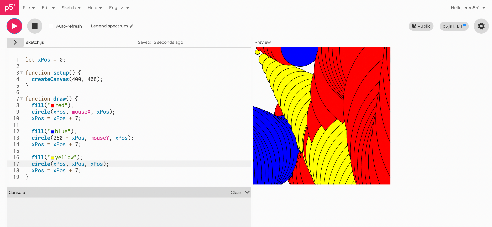
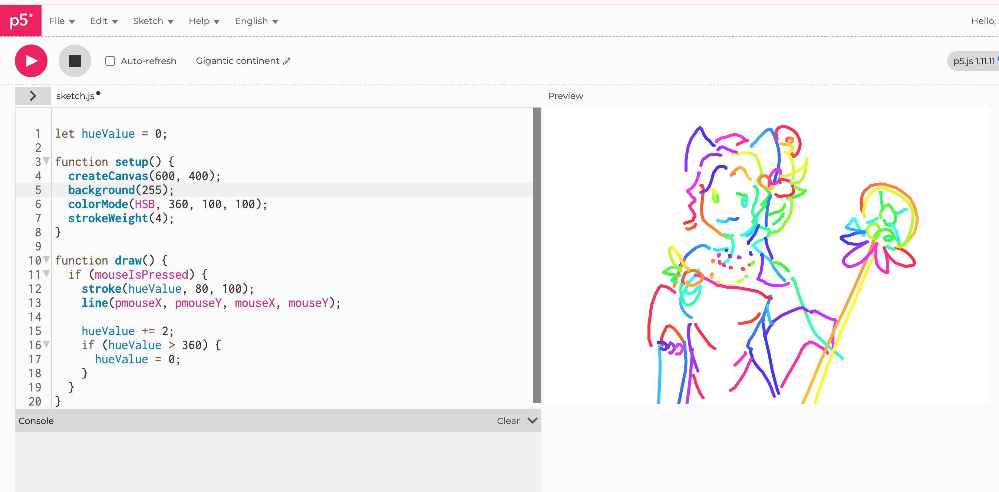
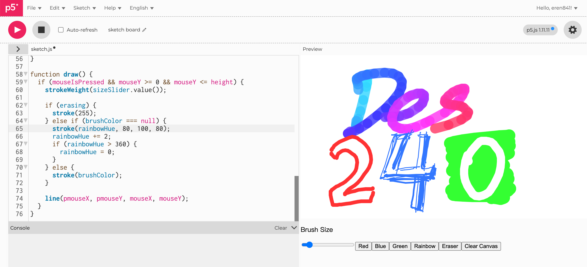

# Week 02

[← Back to Home](../index.md)

# Experiment 2: Interactivity

## In-Class Activities

During the class session, we explored the basics of p5.js and how simple shapes can be drawn using code.

We experimented with different drawing functions such as:

- rect()
- triangle()
- line()
- ellipse()

By changing parameters like position, colour, and order of instructions, I observed how small changes in code could produce very different visual results.

Instead of focusing on a single polished composition, I spent some time experimenting with unusual combinations of shapes and parameters (for example I would try to combinate few functions together, or add extreme positions). This produced several unexpected and sometimes very weird visual outcomes. It's quite quirky, but I found it really interesting...

*Exploring the background() function*

These playful experiments helped me better understand how p5.js renders shapes and how the sequence of commands affects the final composition.

## Activity 3: Vibe Code an Interactive Sketch

During this activity I began experimenting with p5.js by trying to combine different shapes and behaviours in my sketches. However, I frequently encountered errors in the console and some of my code did not run as expected.

*I created a series of ellipses and then changed their coordinates, replacing them with mouseX and mouseY.*

To troubleshoot these issues, I started using AI to help identify and fix problems in my code. This allowed me to understand why certain errors were happening and what changes could make the sketch work correctly.

Once the code was running more reliably, I began using the AI more playfully to explore features that I found in the p5.js reference because I just can't stay serious for more than a minute. Instead of following a strict plan, I experimented with different interactions and functions.

At this point I realised that p5.js felt somewhat similar to Scratch, which I used when I was younger. This made me curious about whether I could use p5.js to create small interactive games as well...

<iframe 
  src="https://editor.p5js.org/eren841/full/oBzZGhXoi"
  width="400"
  height="410">
</iframe>

*I made this weird dodge ball interactive game using Chatgpt...*

As a result, I began experimenting with mouse-based interactions and testing different behaviours, such as objects following the cursor or reacting to mouse movement. After I learned the mouse movement functions, I start actually making the interactive sketch.

I saw some tutorials about sketches, but I wanted to create that nice looking gradient effect, so I explore and ask AI to check on my errors.

<iframe 
  src="https://editor.p5js.org/eren841/full/KLYZC4vT0"
  width="400"
  height="410">
</iframe>

*There is it... The gradient effect!*

At this point I'm started to think what if I can create a real sketching board that can change brush colour and an eraser using DOM buttons... So I start trying, this is the result:

<iframe 
  src="https://editor.p5js.org/eren841/full/rcLlDceDd"
  width="500"
  height="600">
</iframe>

*A real sketch board! you can even adjust the brush size.*

This helped me understand how p5.js can combine canvas drawing with interface elements such as buttons and sliders. It also showed me how interaction can make a sketch more playful and customisable for the viewer.

### Reflection

I was surprised by how quickly simple code could generate complex and sometimes unexpected visual patterns. Some basic sketches worked immediately, especially when experimenting with mouse interaction and simple shapes.

However, I often encountered console errors when combining different pieces of code, because I kept forgetting the use of brackets. Using an AI assistant helped me debug these issues and understand how the code worked. Reading and modifying the generated code helped me learn more about how p5.js handles interaction, variables, and drawing behaviour.

---

# Independent Study: Interactive Data Portrait

## Overview

Take the data you collected for **Experiment 1** and use it as the basis for an **interactive p5.js sketch**.

The challenge is to translate your **hand-drawn data portrait** into something a viewer can explore, control, or manipulate through interactive elements.

---

## Step 1: Translate Data Drawing into Code

My first goal was simply to translate the data I collected in Experiment 1 into a digital form using p5.js. In my hand-drawn data portrait, each circle represented a day and the small coloured marks around the edge represented moments when I reached for my phone. The position of each mark corresponded to the time of day, while the colour represented my emotional state.

In the prototype, I focused on reproducing this structure in code. I created a circular clock-like layout and plotted points around the circle according to the time value of each moment. At this stage the sketch was mostly static and served as a direct translation of the original drawing rather than an interactive visualization.

<iframe 
  src="https://editor.p5js.org/eren841/full/6rqbYGTff"
  width="500"
  height="560">
</iframe>

In my dataset, the time values are numeric, so they can be directly used as numerical data in the code. I recorded each moment as an object, for example:

{ time: 10.1, feeling: "neutral", action: "check notification" }  
{ time: 11.0, feeling: "neutral", action: "scrolling" }

The time values allow the sketch to calculate positions around the circular clock structure by mapping the time to an angle.

Emotions function as categorical data. Instead of storing them as numbers, I used different colours to represent each emotional category. A function such as `feelingColor(f)` assigns a specific colour to each emotion (for example boredom, neutral, upset, happiness, or curious), which makes it easier to visually distinguish emotional states.

The actions (such as watching videos, chatting, or gaming) are more qualitative and difficult to quantify numerically. Because of this, they are stored as text labels and displayed as descriptive information when the viewer hovers over a data point.

---

## Step 2: Design Interactive Visualisation

After translating the structure of the drawing into code, I began exploring ways to make the visualization more interactive. I added several DOM controls so that viewers could manipulate what they see.

Buttons allow the viewer to switch between the four recorded days, while checkboxes filter different emotional states. I also added sliders that limit the visible time range, allowing viewers to focus on particular parts of the day.

These interactions allow the viewer to actively explore the patterns in the data rather than simply observing a static image. For example, viewers can compare different days, isolate specific emotions, or examine when certain behaviours occur.

---

## Step 3: Iterate

Through several iterations I refined both the visual design and the interaction. One change was removing the adjustable dot-size control, because it did not represent a meaningful data variable, it was there simply because I thought more slidebars and interactive DOM buttons are good, but my friend says it was redundant, and I agreed. Now, all data points were placed consistently along the centre of the circular ring to create a cleaner visual structure.

I also redesigned the circular background using a colour gradient that transitions from warm yellow tones to dark blue. This visually represents the passage from daytime to nighttime and helps viewers intuitively understand the temporal structure of the data.

Finally, I added controls that allow users to add or remove moments from the dataset through input fields and buttons. This makes the sketch more interactive by allowing viewers to experiment with how additional moments would appear within the daily cycle.

<iframe 
  src="https://editor.p5js.org/eren841/full/jm9nQ_wnk"
  width="700"
  height="700">
</iframe>

---

## Reflection

From my Experiment 1 data portrait, I chose to focus on three main aspects: the time of each moment, the emotional state, and the activity that caused me to reach for my phone. Time values were used as numeric data to position points around the circular clock structure, while emotions were represented through colour categories.

To make the visualization interactive, I added DOM controls such as buttons to switch between different days, checkboxes to filter emotional states, and sliders to adjust the visible time range. I also added input fields and buttons that allow viewers to add or remove moments from the dataset.

Through interaction, viewers can explore patterns that are harder to notice in the hand-drawn portrait, such as when certain emotions occur or how frequently I check my phone at different times of day. Hover interactions also reveal additional details about each moment.

During development I used AI tools as part of a “vibe coding” process to help debug errors and experiment with new p5.js features. This helped me understand how data structures and visual mappings work in creative coding.

With more time, I would like to add small icons representing different activities and experiment with animation so that moments appear gradually around the clock. These additions could make the visualization closer to the visual language of my original drawing.

Overall, this project helped me see how a personal dataset can be translated into an interactive visualization, and how coding can function as a creative design tool.

## AI Usage Statement

Artificial intelligence (ChatGPT, OpenAI) was used to assist with brainstorming ideas and refining the wording of written sections in this journal entry, including parts of the overview, data collection description, and reflection. The AI tool was used as a language support tool to help organise thoughts and improve clarity of expression.

All data collection, observations, sketches, and the final visualisation were created by the author. The conceptual development, data recording, and visual design decisions were completed independently.

AI assistance was limited to editing, language refinement, and discussion of ideas, and all final content was reviewed and adapted by the author.