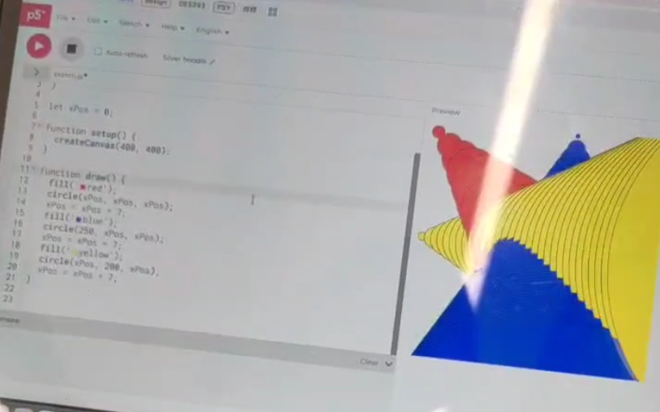
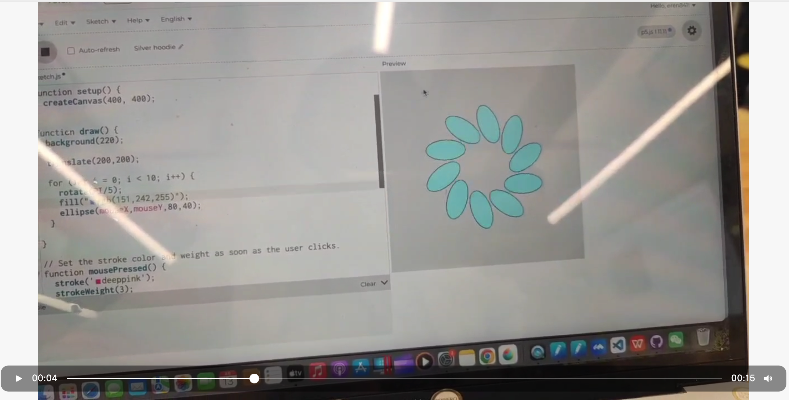

# Week 02

[← Back to Home](../index.md)

# Experiment 2: Interactivity

## In-Class Activities

During the class session, we explored the basics of p5.js and how simple shapes can be drawn using code.

We experimented with different drawing functions such as:

- rect()
- triangle()
- line()
- ellipse()

By changing parameters like position, colour, and order of instructions, I observed how small changes in code could produce very different visual results.

Instead of focusing on a single polished composition, I spent some time experimenting with unusual combinations of shapes and parameters (for example I would try to combinate few functions together, or add extreme positions). This produced several unexpected and sometimes very weird visual outcomes. It's quite quirky, but I found it really interesting...

*Exploring the background() function*

These playful experiments helped me better understand how p5.js renders shapes and how the sequence of commands affects the final composition.

## Activity 3: Vibe Code an Interactive Sketch

During this activity I began experimenting with p5.js by trying to combine different shapes and behaviours in my sketches. However, I frequently encountered errors in the console and some of my code did not run as expected.

To troubleshoot these issues, I started using AI to help identify and fix problems in my code. This allowed me to understand why certain errors were happening and what changes could make the sketch work correctly.

Once the code was running more reliably, I began using the AI more playfully to explore features that I found in the p5.js reference because I just can't stay serious for more than a minute. Instead of following a strict plan, I experimented with different interactions and functions.

At this point I realised that p5.js felt somewhat similar to Scratch, which I used when I was younger. This made me curious about whether I could use p5.js to create small interactive games as well...

As a result, I began experimenting with mouse-based interactions and testing different behaviours, such as objects following the cursor or reacting to mouse movement. Some of these experiments resulted in strange or unexpected sketches that were not originally intended, but they helped me better understand how interaction works in p5.js.

Overall, this process felt very exploratory and playful. Rather than producing a polished final piece, I focused on learning how the system behaves and discovering what kinds of interactive possibilities the code could produce.

*I created a series of ellipses and then changed their coordinates, replacing them with mouseX and mouseY.*

<iframe 
  src="https://editor.p5js.org/eren841/full/oBzZGhXoi"
  width="400"
  height="400">
</iframe>

*I made this weird dodge ball interactive game using Chatgpt...*

Reflect on:
- What surprised you?
- What worked the first time?
- What didn't work?
- What did you learn from reading the code?

---

# Independent Study: Interactive Data Portrait

## Overview

Take the data you collected for **Experiment 1** and use it as the basis for an **interactive p5.js sketch**.

The challenge is to translate your **hand-drawn data portrait** into something a viewer can explore, control, or manipulate through interactive elements.

---

## Step 1: Translate Your Data Drawing into Code

Look at the data you collected by hand last week.

Consider:
- Which values are **numeric**
- Which are **categories**
- Which are **qualitative or difficult to quantify**

You do not need to represent everything.  
Choose the aspects of your data drawing that are **most interesting to make interactive**.

---

## Step 2: Design Your Interactive Visualisation

Create a p5.js sketch that includes **interactive elements** allowing the viewer to explore your data.

Use DOM elements such as:

- buttons
- sliders
- text inputs
- dropdowns
- checkboxes

These controls should allow the viewer to **change or manipulate what they see**.

### Consider

- What can interaction reveal that your hand-drawn portrait could not?
- How do your controls relate to the structure of your data?
- What happens when the viewer changes something?
- Is the response **immediate, gradual, or surprising**?

Use the p5.js reference and tutorials to learn new techniques.

---

## Step 3: Iterate

Test your sketch.

Show it to someone else and observe how they use it.

Refine the interaction based on what you observe.

---

# Document Your Process

Each entry in the Making Journal should include **visual and textual evidence**, such as:

- sketches
- screenshots
- GIFs
- diagrams
- process notes
- instructions
- reflections

---

## Reflection Questions

Address the following questions in your journal:

- What data and visual aspects from Experiment 1 did you choose to work with, and why?
- How did you decide which interactive elements to use?
- What can a viewer learn by interacting with your sketch that they could not from the hand-drawn portrait?
- Did you use vibe coding or other tools in your process? What did you learn from this?
- What would you develop further with more time?
- Any other reflections?
## Images & Media

*Use the format below to embed images from your assets folder:*

``
`*Your caption here*`

*The text inside the square brackets is alt text (a description for accessibility), not a visible caption. To add a caption, place a line of italic text below the image.*

## AI Usage Statement

*Document any use of AI tools under an AI Usage Statement heading. Explain which tools you used and describe how you used them. Reference any AI-generated content (see [QuickCite](https://auckland.libguides.com/referencing-generative-ai-tools) for guidance).*
