# Week 03

[← Back to Home](../index.md)

# Experiment 3: Live Data
## In-Class Activities

Explore through digital and analogue approaches, learning how to access, filter, and translate live data into visual and material forms. These activities build on the coding fundamentals from Experiment 2, while also introducing analogue practices rooted in rule-based and generative design.

## Activity 1: Explore with cURL

Using terminal and the documentation / GitHub repos for wttr.inLinks to an external site. and the Free Dictionary APILinks to an external site...

Get the weather for a location using its GPS coordinates

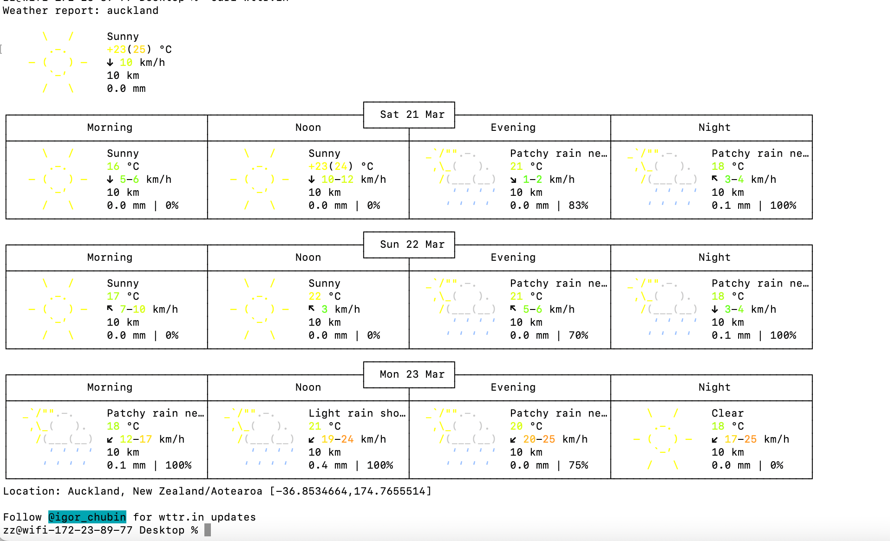
*curl "wttr.in/-36.85,174.76"*

Get the weather in a different language

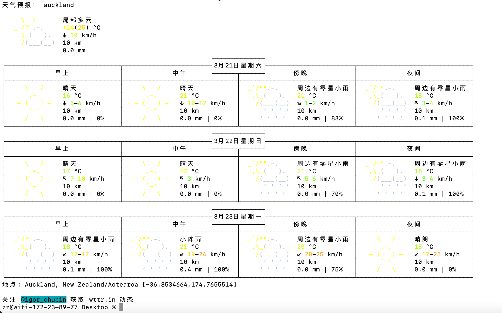
*curl "wttr.in/Auckland?lang=zh"*

Get the current moon phase

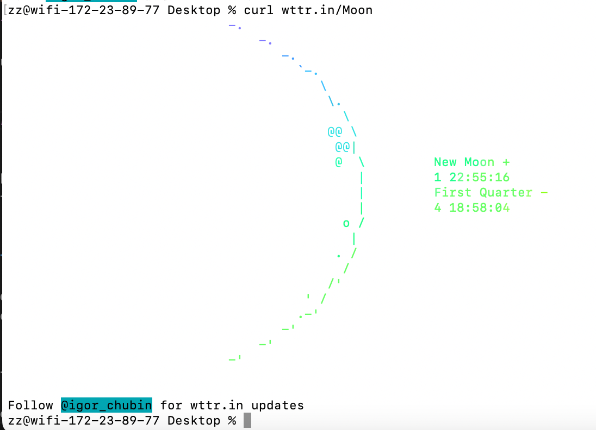
*curl wttr.in/Moon*

Look up the synonyms and antonyms of a word： happy

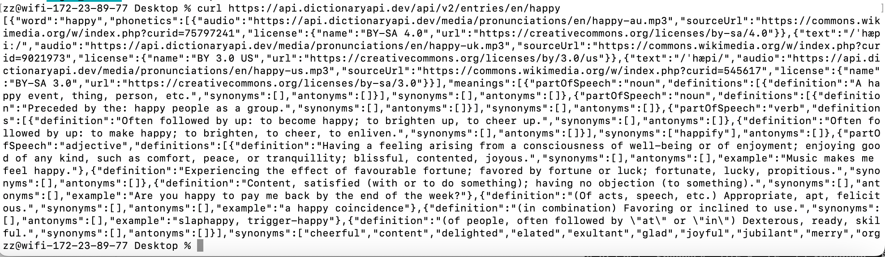
*"synonyms":["cheerful","content","delighted","elated","exultant","glad","joyful","jubilant","merry"]*

Something else in the github documentation that we haven't covered...
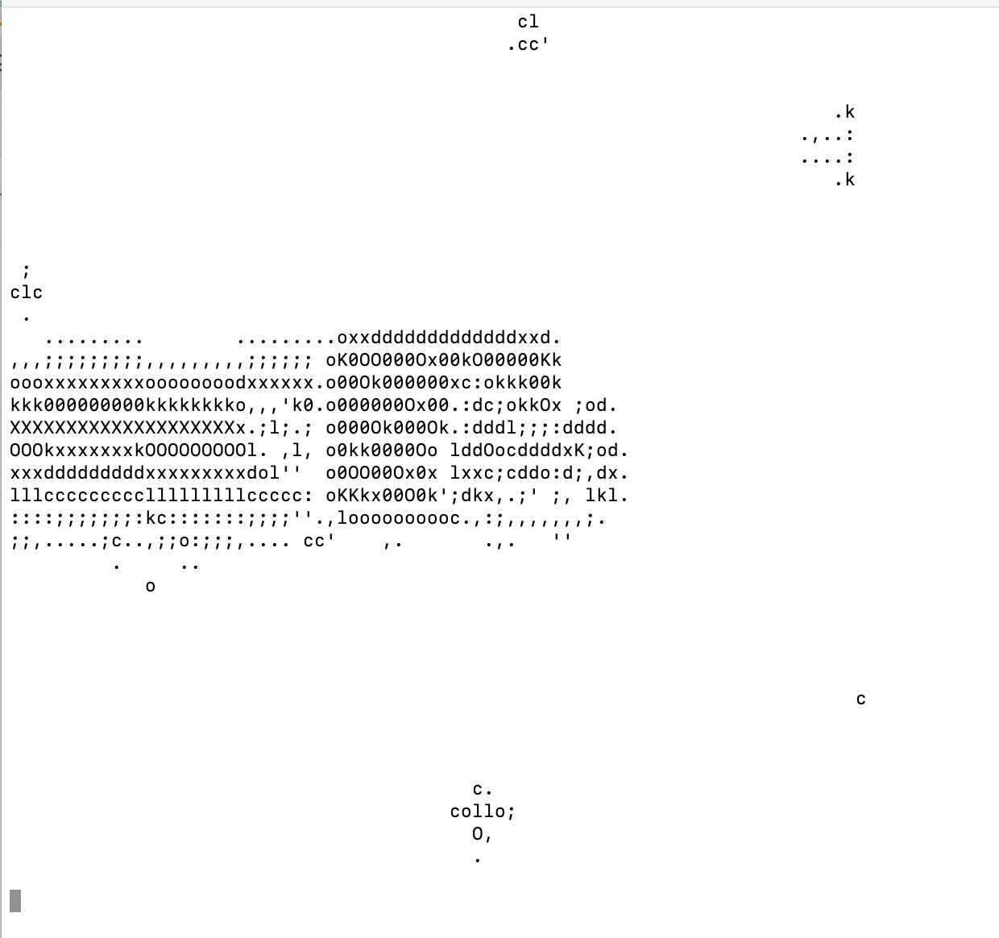
*curl ascii.live/nyan*

## Activity 2: Weather Visualisation

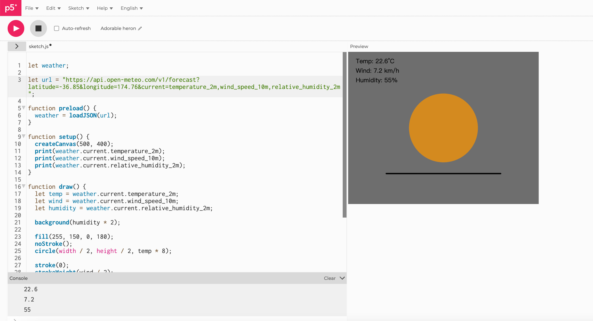
*current weather data for Auckland*

### Experiment with the sketch:

Change the latitude and longitude to a different city and observe how the sketch changes.
Use the data to control different visual properties: colour, position, size, number of shapes.

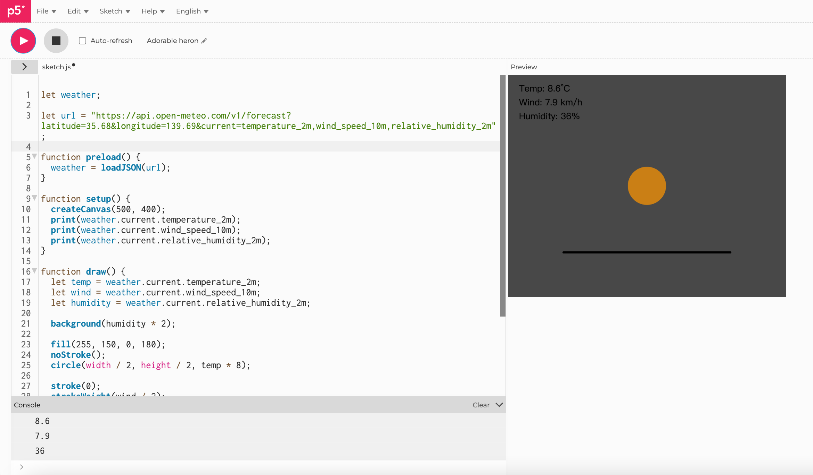
*changing the latitude and longitude changed the visual output because the weather values were different.*

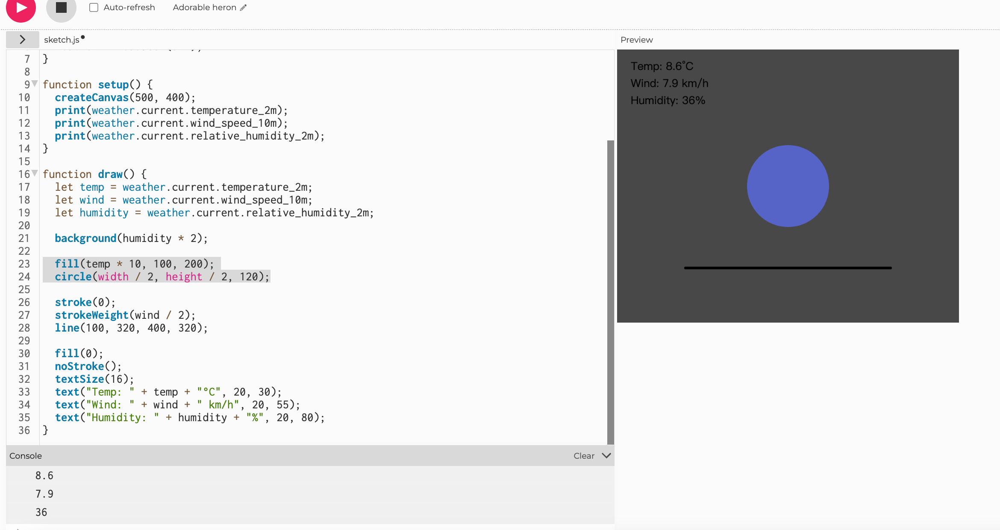
*playing around with the colour...*

Add more weather variables from the Open-Meteo documentationLinks to an external site. to the API URL.
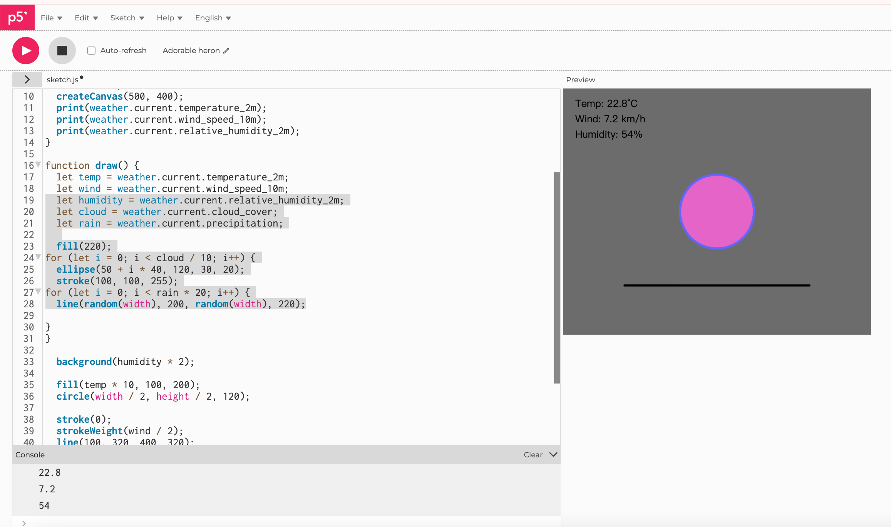
*I added humidity, cloud and rain*

Try using random() or noise() alongside or instead of the live data.

<iframe 
  src="https://editor.p5js.org/eren841/full/Y7W-9vOPO"
  width="700"
  height="540">
</iframe>

*I made the effect quite...intense so the data is very visible.*

I used `random()` to introduce *lively* motion and variation into the sketch. 
The wind speed affected how much the central sun shape shook, while rain and atmospheric details were drawn in different random positions on every frame. 
This made the live weather data feel more dynamic, and... expressive, rather than static.

### Use vibe coding to try something more ambitious

yes...this is where I found this effect is somewhat similar to the... analog horror style. So... wht not try make it a weather analog horror... but with real data! I'll explain how the data is linked to the presentation, and these data are found on Open-Metro. So I asked Chatgpt to refine and made my idea into THIS......

<iframe 
  src="https://editor.p5js.org/eren841/full/fsA9slAZp"
  width="900"
  height="600">
</iframe>

Instead of creating a conventional weather visualisation, I experimented with transforming live data from the Open-Meteo API into a slightly uncanny “weather surveillance” interface. You can change the location by pressing the button on the top.

 Each weather variable was mapped to a visual behaviour: temperature controls the size and colour of the sun (including a shift to blue below 0°C), wind speed affects movement and instability of the rain drops and sun, precipitation influences the density and thickness of rain, and humidity is expressed through the appearance and intensity of tears. (if humidity >60%, the tear will appear.)

This approach allowed me to explore how data can shape not only visual form, but also atmosphere and emotional tone. Although I know this is more experimental and quirky, it remains directly driven by real data, so it is still a data-driven design.

## Activity 3: Design and Execute a Data Protocol

In pairs, design a data protocol: a set of rules for translating a live data source. This is the analogue equivalent of an API: a defined set of rules for requesting and receiving data.

Your protocol must specify:

Source: what live data to observe (e.g. sounds in the room, a live transport tracker on your phone)
Frequency: how often to check (e.g. every 10 seconds, every minute)
Mapping: how to record each observation as a mark, shape, or action
Write your protocol as a clear set of instructions on a sheet of paper. Someone who wasn't in your pair should be able to follow them without explanation.

Swap your protocol with another pair and follow their instructions for 10 minutes. Don't ask any clarifying questions, just interpret the rules as written.

When time is up, compare your output with what the designers intended. Did you interpret the rules as they expected? Where was the protocol ambiguous? What surprised you about the result?

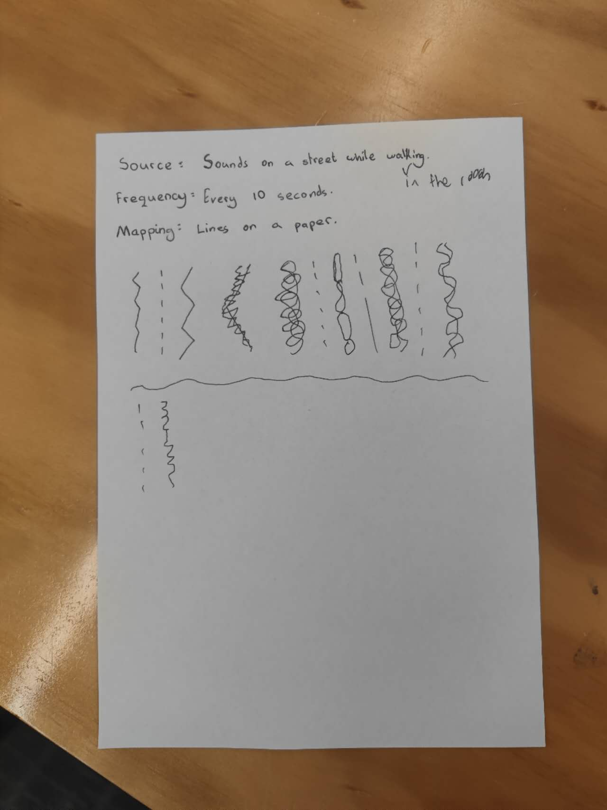

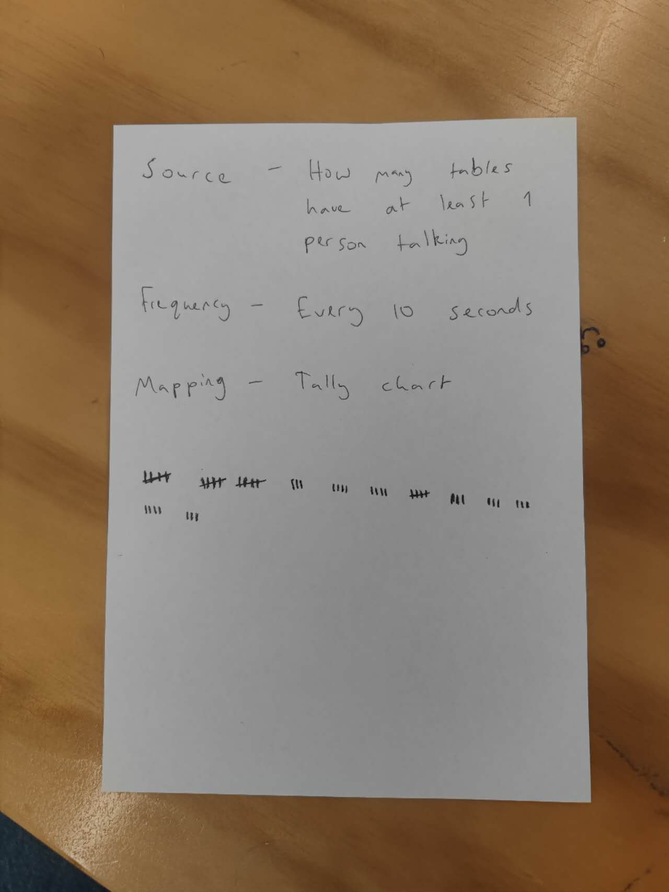

In this activity, we designed a data protocol based on recording sounds while walking in the room. Every 10 seconds, listen to the surrounding environment and translated what you heard into different types of lines on paper. We swaped with another group, their protocal is how many tables have at least 1 people talking every 10 seconds.

When another group followed our protocol, their results were similar in structure but different in detail. They interpreted the types of sounds slightly differently, which led to variations in the line styles. This showed that although the rules were clear in terms of frequency and format, the mapping between sound and visual form still allowed for personal interpretation.

When we followed the other group's protocol (counting how many tables had at least one person talking), we found it much more precise and structured. The tally chart system reduced ambiguity, but it also felt more rigid and less expressive compared to our line-based approach, and also because we are all discussing about the activity, most tables are always talking, so the data range is not wide.

This comparison highlighted how different types of data protocols can produce very different outcomes. Our protocol was more open-ended and expressive, while the other group’s protocol was more quantitative and consistent. It made us realise how important clarity and specificity are when designing instructions, especially if the goal is to minimise interpretation.

# Independent Study: Live Data Visualisation

*Building on the in-class activities, create a work that engages with live data (data that is ongoing and changing). You can either take a digital approach, or an analogue/physical approach.*

I chose a digital approach using p5.js because I wanted to work with live, constantly updating data and explore how it could be translated into an evolving visual system, and because I think it is easier to create more effect using p5js than on paper. A digital sketch allowed me to fetch real-time earthquake data through an API and directly map that data into dynamic visual elements such as movement, colour, and density.

Compared to an analogue approach, the digital format made it easier to experiment quickly, iterate on different mappings, and observe how the visualisation changes over time in response to live data.

I worked with earthquake data from the USGS Earthquake API. I accessed the data using p5.js’s loadJSON() function, which retrieves live GeoJSON data from a URL.

I constructed the API URL dynamically based on a selected date range, allowing me to query earthquakes from a specific day as well as the previous three days. This enabled me to create both a “current layer” and a “memory layer” in the visualisation.

I'll explain several earthquake properties to visual elements: Larger earthquakes are represented by bigger circles and more surrounding particles, suggesting a stronger release of energy (Magnitude). Shallow earthquakes appear in warmer tones (orange/red), while deeper ones shift towards cooler blue tones. More recent earthquakes are brighter and more visually dominant, while older ones appear darker and more subdued. I separated the data into a main layer (selected day) and a memory layer (previous three days), creating a sense of temporal depth. I also want some spatial and temporal proximity showing connections, so I added thin lines connect events that are close in both time and space, showing possible relationships such as aftershocks.

<iframe 
  src="https://editor.p5js.org/eren841/full/jcg8EUxn1"
  width="900"
  height="650">
</iframe>

The visualisation reveals patterns that are difficult to perceive in raw numerical data, such as clustering, intensity, and temporal continuity. Instead of presenting earthquakes as isolated points, the work communicates them as part of an interconnected field. I used vibe coding and LLM assistance throughout the process, which helped me learn how to construct API queries, interpret JSON data, debug using the console, and translate conceptual ideas like “memory” into code logic.

This work relates to Conditional Design through its rule-based system, to Nathalie Miebach in its translation of environmental data into expressive form, and to David Bowen in its use of real-world data as a generative input. With more time, I would refine the connection logic, add interaction (such as hover-based information), and explore longer temporal animations. Overall, this project helped me understand that data visualisation is not only about displaying information, but about shaping how it is perceived and experienced.

## AI Usage Statement

I used AI tools (ChatGPT) to support my coding and writing process, including understanding APIs, debugging, and refining ideas. The AI provided guidance and suggestions, but all final design decisions, mappings, and interpretations were developed and evaluated by myself. AI was used as a support and learning tool rather than generating the final work.

### AI tool reference

OpenAI. (2024). ChatGPT (GPT-5) [Large language model]. https://chat.openai.com