# Week 04

[← Back to Home](../index.md)

# Experiment 4: Artificial Intelligence
## In-Class Activities

Exploring local and cloud-based AI workflows. These activities introduce the practical and ethical dimensions of working with AI, building on the ideas about data representation from previous experiments.

### Ollama

For this activity, I experimented with a local AI workflow using Ollama and compared it to my experience using cloud-based AI tools. I tried describing data from experiment 1 and asking for visualisation ideas, and ask it to write code, as well as some random quesitons.

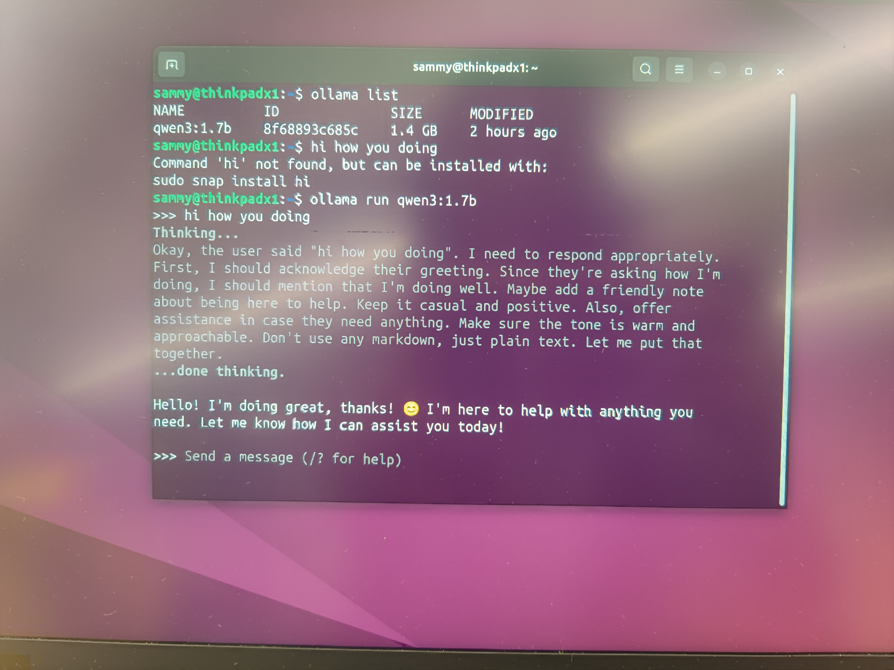

 I found that the local model felt much slower and often spent a long time “thinking” before generating a response. (It thinks so much longer than cloud-based AI tools, it takes about 3-5 mins to generate an answer.) For general brainstorming and simple discussion, the responses were sometimes useful, but when I asked it to generate p5.js code, the output was less reliable and often contained errors that prevented it from running properly.

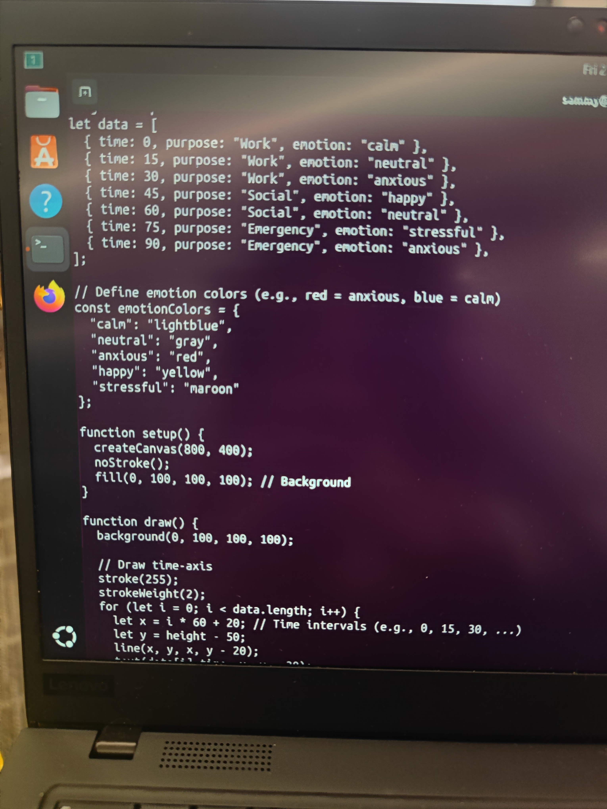

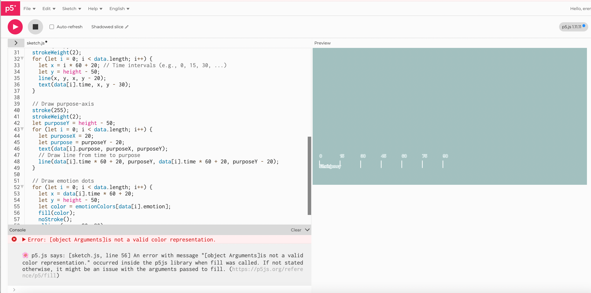
*There are some error in the script and can not run the script successfully*

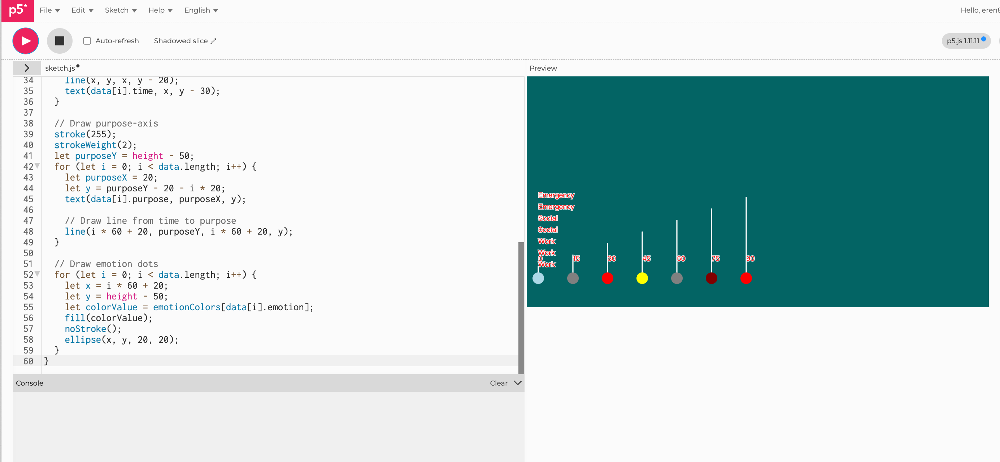
*I fixed the errors and this is what it looks like... It is functionally ok, but less aesthetically pleasing*

This made the comparison with cloud-based AI much clearer. Local AI offered an important advantage in terms of privacy and control, since the model ran on my own machine and no data needed to leave my computer. However, this came with trade-offs in speed, capability, and code quality. In contrast, cloud-based AI felt faster, more responsive, and more effective for debugging and refining code, especially when working on a creative coding project.

This activity helped me understand that AI workflows involve different trade-offs rather than a simple “better or worse” distinction. Local AI may be more suitable for privacy-sensitive or offline contexts, while cloud-based AI is currently more effective for complex coding support and iterative creative development.

## Activity 2: Cloud AI with NotebookLM

### NotebookLMLinks

In this activity, I used NotebookLM to analyse my own sources, including my Making Journal and references such as Nathalie Miebach’s work. I asked questions about what my design outcomes might be, what themes appeared across my experiments, and how practitioner examples influenced my work.

The responses were presented as short, structured summaries, which made it easier to see patterns that I hadn’t clearly noticed before. One important insight was that my work consistently focuses on translating live data into emotional or atmospheric experiences, rather than just displaying information. For example, the AI connected my earthquake visualisation, analogue sound recording protocol, and earlier data experiments as part of a broader idea of “data as experience” or even “data as memory”.

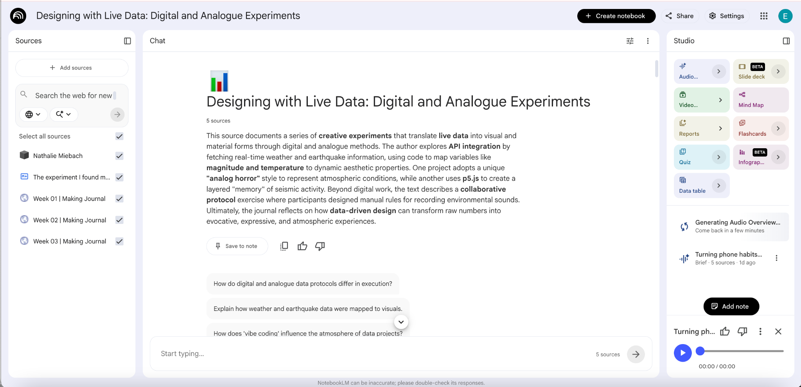

I found it interesting that the AI was able to construct a coherent narrative across my experiments, even though I originally approached each task separately. This gave me a new perspective on my own work. At the same time, some responses felt slightly simplified, and did not fully capture the complexity of my intentions.

Overall, this activity showed that cloud-based AI is particularly useful for interpreting and synthesising ideas across multiple sources. Compared to local AI, it felt more effective for higher-level reflection and conceptual thinking, rather than technical problem-solving.

# Independent Study: AI-Assisted Data Exploration
## Overview

Choose a public dataset about life in Aotearoa New Zealand and use cloud-based AI tools to explore, interpret, and represent the data. The challenge is to go beyond a single prompt, working through sustained dialogue with the AI, directing its decisions, and critically evaluating its outputs.

### Step 1: Find a Dataset

*Browse the open data catalogue at catalogue.data.govt.nz. and find a dataset that interests you. Look for something with a downloadable CSV file that is small enough to upload into a cloud AI tool (aim for under 10MB, or a few thousand rows).*

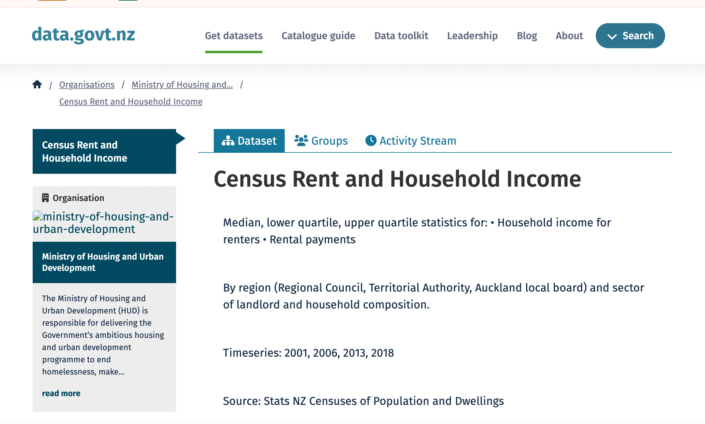
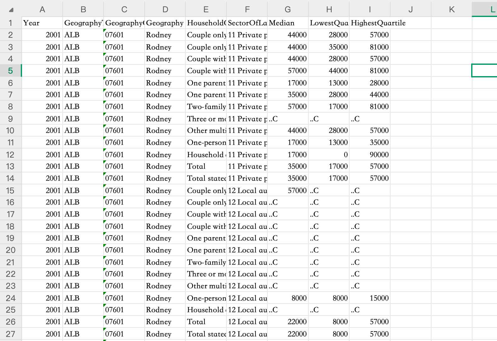

I want to investigate the housing (renting) prices to find out how people coping the changing housing price in NZ. I found this dataset, it does not show rent directly, but instead shows income, which shifts the focus from housing prices to people's ability to afford housing. and it is just 5MB, and the data is related to a real aspect of life in Aotearoa that I can explore further, so I decided to use this.

### Step 2: Understand the Data

*Upload your CSV into a cloud AI tool (e.g. CoPilot, Gemini, NotebookLM, ChatGPT) and have a conversation about it. Ask the AI to explain what is in the dataset: what the columns mean, what the values represent, how much data there is, and what is missing or incomplete.*

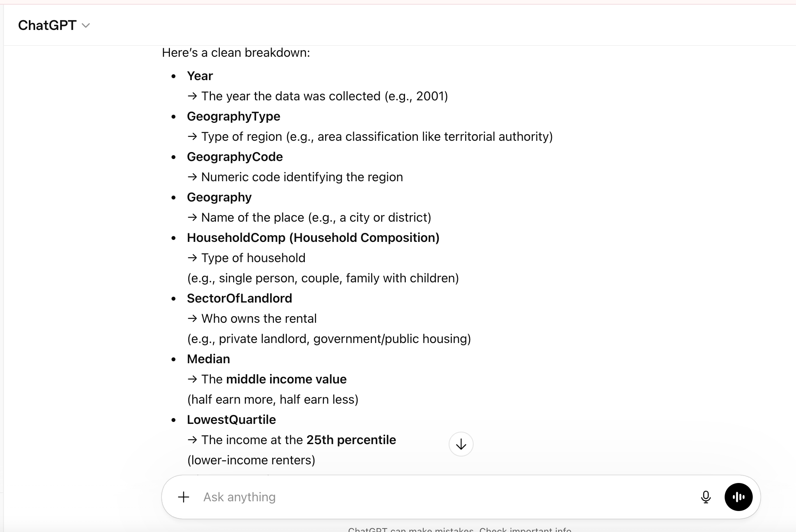

So by chatting with chatGPT for a while I got some explanations about the dataset. 

This dataset represents the distribution of household income among renters across different regions, household compositions, and landlord sectors. It reveals significant income disparities within renting populations, showing potential issues of housing affordability and socioeconomic inequality. 

However, the dataset lacks contextual variables such as rent costs, demographic characteristics, and household size, the understanding of renters’ lived experiences is limited.

### Step 3: Design Multiple Representations

*Ask the AI to produce a visualisation of the data, but don't accept the first output. Direct the AI: specify the form, the visual encoding, the audience, the story you want to tell. Iterate through at least three distinctly different representations of the same data. These could be code-based (e.g. p5.js or HTML), textual, visual, or even prompts for physical/analogue translations.*

*For each version, make deliberate design decisions about what to change. You might vary the format (chart, map, interactive page, narrative text), the visual encoding (colour, size, position, shape), or what subset of the data to foreground.*

I asked the AI tool to create a code-based data visualisation in p5.js to illustrate the trend of the rents. This is the first output it produced:

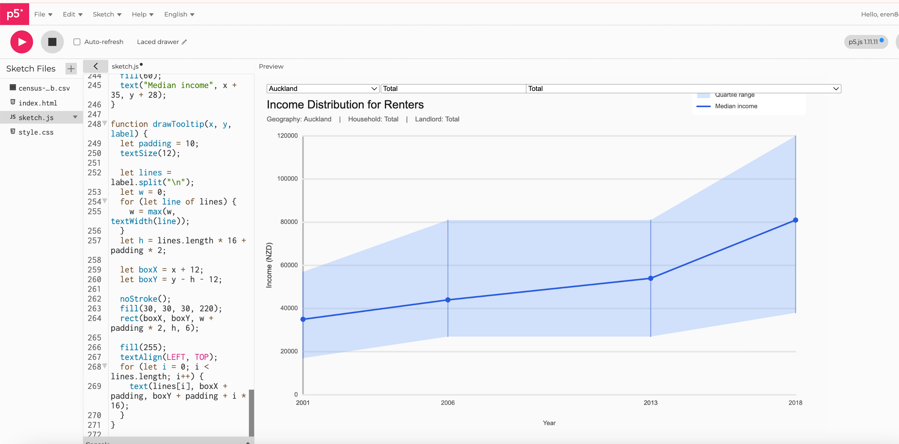
*first output*

It is very basic just a visualisation I can do in google sheets. Therefore I want to change the visual encoding a bit in the iteration.

### Iteration 1

In the first iteration, I changed the visual form into quartile pillars, where each year is represented as a vertical income spread. This shifts attention from trend lines to inequality itself, making the distance between lower- and higher-income renters more immediate and easier to compare as shapes:

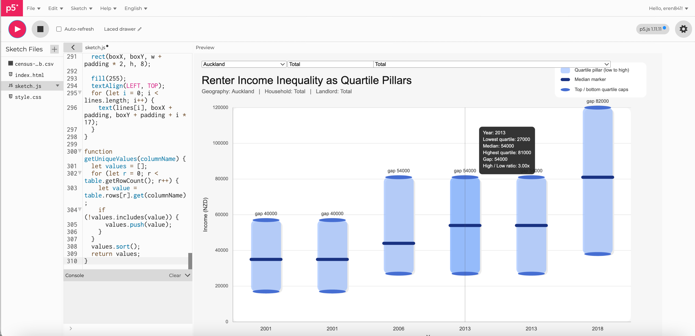
*Iteration 1*

### Iteration 2

Okay, now I want it to be more creative, change the visual encoding more dramatically, but simultaneously showing the humanities aspect...

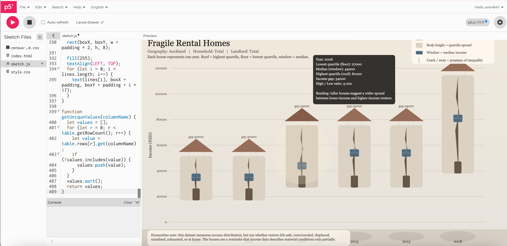
*Iteration 2*

In this iteration I moved away from conventional chart forms and used rented houses as the main visual metaphor. Each year is represented as a fragile home, where the roof marks the highest quartile, the floor marks the lowest quartile, and the window shows the median income. This reframes the dataset as a question of shelter and inequality rather than abstract economic values. The design aims to make the data feel more social and human, while also acknowledging that the dataset still cannot show lived experiences such as insecurity, discrimination, overcrowding, or emotional stress.

However, it feels a bit...forced, like data that was just cobbled together and given a different look. I'm thinking that in the next iteration, maybe I could drop some of the precise counting and make some trade-offs with the presentation to make it more logical and visually appealing.

### Iteration 3

So I ask it to discard the bar chart, and use more freeform data presentation, like a map, showing NZ's map and different locations present in different colours, and different looking little houses to represent the income status of that region.

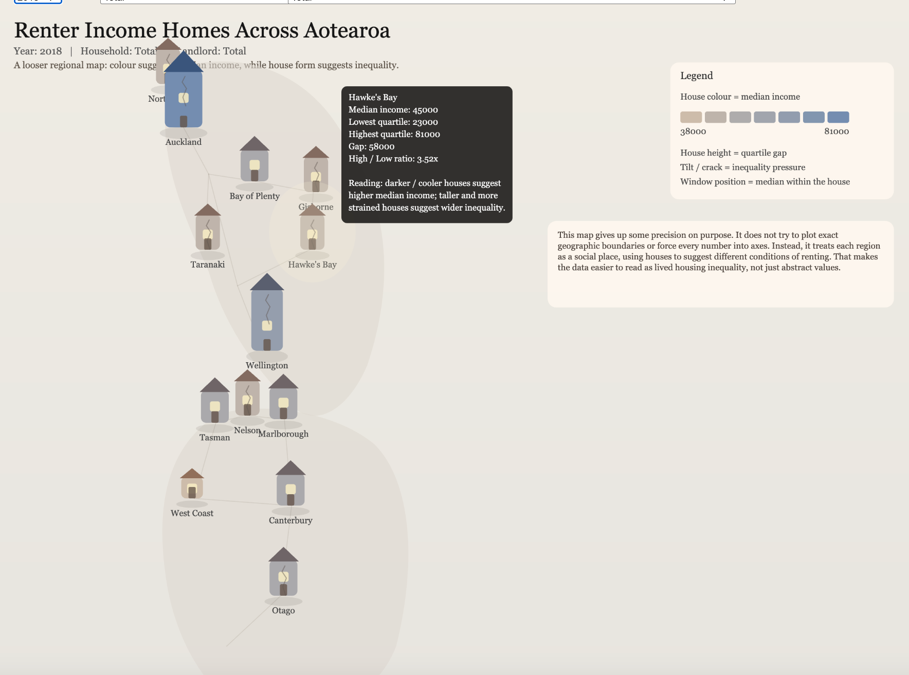
*Iteration 3*

Now this looks better and make the data visualisation more intuitive. Instead of just bar chart changing costume, this is more of a visual display without too much number on the screen.

However I couldn't help myself to think it could be more visually appealing, I'm thinking of adding Maori asthethics to show more linkage to the people and further make the graph less rigid. I think I can ask it to introduced slow animated flow lines as well, to represent spatial relationships between regions. Their thickness reflects the average quartile gap between neighbouring regions, their curvature responds to differences in median income, and their moving pulses respond to inequality pressure. This will make the background motion data-driven, while keeping the visual language soft and atmospheric.

### Iteration 4

<iframe 
  src="https://editor.p5js.org/eren841/full/8ghpHBwtd"
  width="1400"
  height="1150">
</iframe>

*iteration 4*

(Background flow lines
thickness = average quartile gap between neighbouring regions
curve movement = difference in median income
pulse speed = inequality pressure (high/low ratio)
House glow
glow size = median income level
glow pulsing = quartile gap
small instability / sway = inequality pressure)

I decided to stop here at iteration four, this graph combinated my ideas, and keeps interactive and data display. I'm quite surprised about the textures it added, it indeed makes the visualisation more visually appealing, and I'm mostly satisfied about this iteration.

### Step 4: Critically Evaluate

#### Reflection

Using AI tools to analyse and visualise the dataset was both helpful and limiting. On one hand, AI made it much easier to quickly understand the structure of the data, generate summaries, and produce initial visualisations such as bar charts and line graphs. These helped me identify general trends efficiently. However, I noticed that the AI tended to default to standard formats and yes, the classic blue colour schemes, and generic titles. It often assumed that clarity and simplicity were the main goals, without considering emotional, cultural, or contextual dimensions of the data. That is helpful when making data reports, but I think it can't replace a human's creativity.

Because of this, I had to actively redirect the AI to adjusted visual styles, reframed prompts, and asked more specific questions to move beyond generic outputs. It sometimes even feels stubborn, because it links the previous iteration and just refuse to discard its idea, sticking to its weird asthetic choice, and sometimes makes me annoyed. This process made me realise that AI does not “design” independently, it is the person as the designer using it as a tool. It just reflects the assumptions embedded in its training, which often prioritise efficiency over meaning, if not adjusted by the designer.

Comparing different representations of the same data also showed how interpretation can change significantly. A basic chart might highlight frequency or quantity, while a more experimental or visual approach can emphasise patterns, rhythms, or lived experience, as well as visual asthetics. 

The reading on Data Feminism by D’Ignazio and Klein (2020) helped me in understanding this. Their argument that “data are not neutral” and that we should consider power, context, and whose perspectives are included made me more critical of the AI outputs. I realised that the dataset itself already reflects certain choices, like what is recorded, what is ignored, and who is represented. My role as a designer was not just to visualise the data, but to question these structures.

Similarly, Mikaere’s discussion of Māori data sovereignty reframed data as a strategic and cultural resource rather than just information. This made me think of how data in Aotearoa is connected to issues of ownership, governance, and community benefit, and this is why I think adding things to represent culture and humanistics are essential in some cases.

In conclusion, working with AI as a design tool felt like an interesting process. It was fast and efficient, and sometimes help me see my ideas clearer, but I think it must require constant critical intervention. If I had more time, I would further develop more context-aware and culturally responsive visualisations, rather than relying on AI-generated defaults, plus I think they are sometimes bad at asthetic design, as they can only give texture and symbol ideas, that level of creativity and meta-cognition is still owned by us and can't be replaced easily.

## Reference

D’Ignazio, C., & Klein, L. F. (2020). Data feminism. MIT Press.

Mikaere, K. (2018). Māori data sovereignty for whānau transformation [Video]. YouTube. https://www.youtube.com/watch?v=VXy8S3kvnlE

## AI Usage Statement

I used AI tools (ChatGPT) to support my coding and writing process, including understanding APIs, debugging, and refining ideas. The AI provided guidance and suggestions, but all final design decisions, mappings, and interpretations were developed and evaluated by myself. AI was used as a support and learning tool rather than generating the final work.

### AI tool reference

OpenAI. (2024). ChatGPT (GPT-5) [Large language model]. https://chat.openai.com