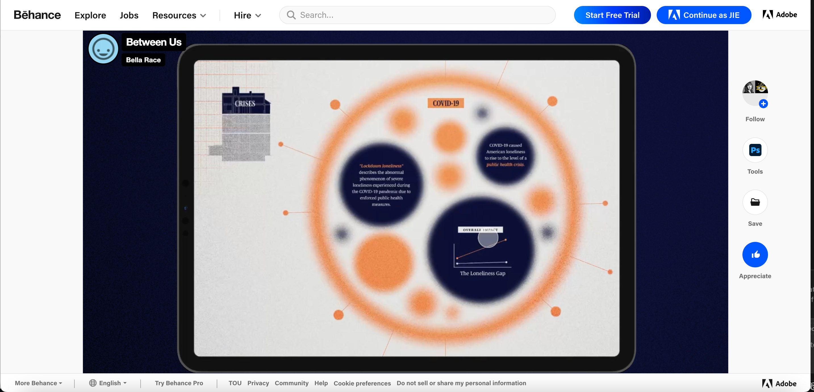
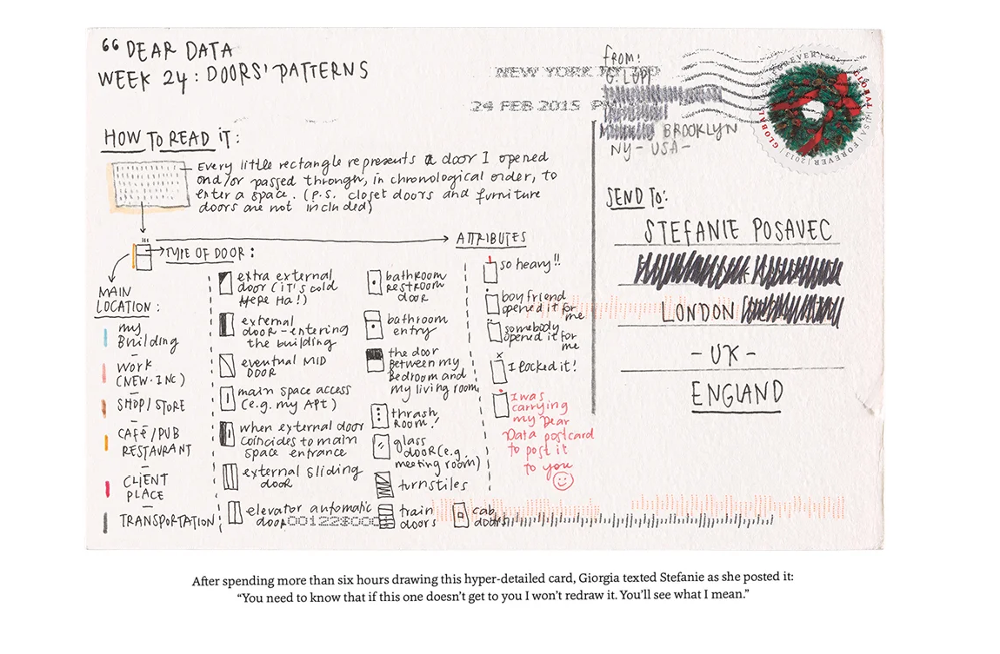
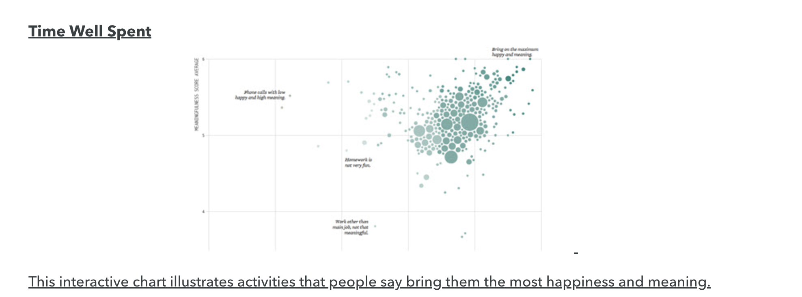
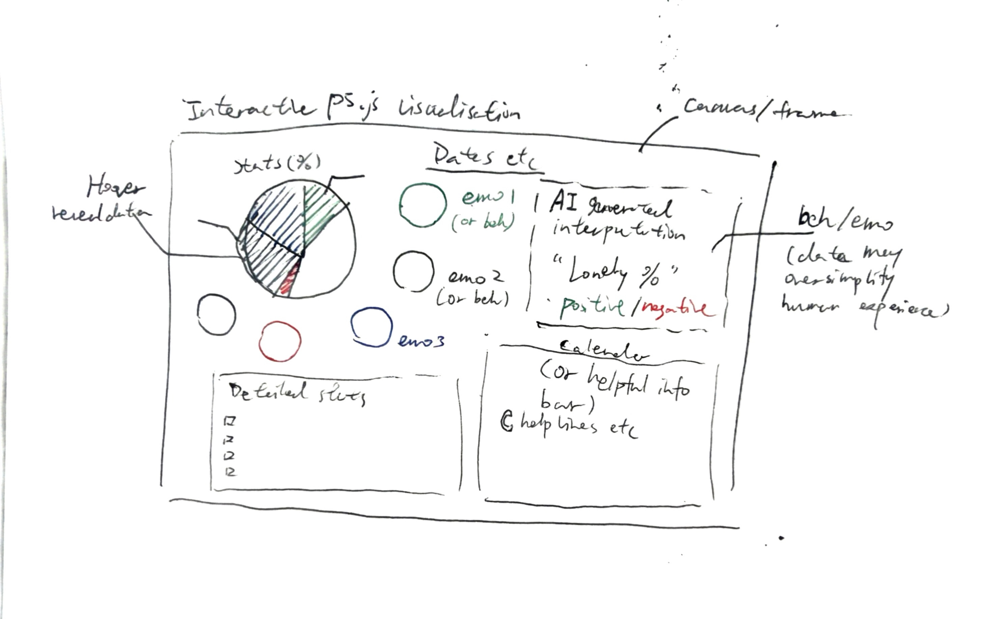
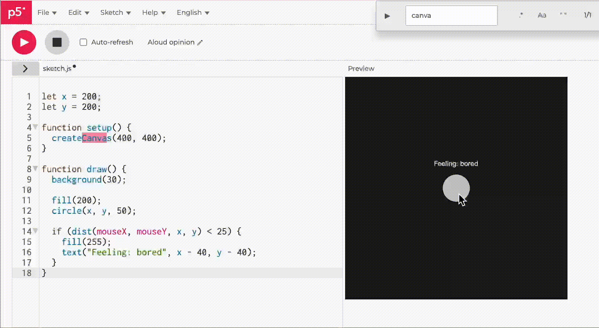

# Week 06

[← Back to Home](../index.md)

## Documentation 
## In-class activities

1. Data Exploration

My project is around data humanism, psychology, everyday life, so I can't find many dataset about how AI record peple phone usage as it may be illegal. The data for my project will be self-collected and focuses on phone usage and emotional states. It includes variables such as time of use, emotional category, and user action and use AI to intergrate data. 

The data is structured as individual entries, where each record represents a moment of phone interaction. Time is recorded as a numerical value, emotions are categorised, and actions are described as text.

One limitation of this dataset is that emotional data is subjective and may not always be accurate. Additionally, phone usage behaviour does not directly represent emotional states, meaning that any interpretation could be oversimplified or misleading, for example late-night phone usage may be interpreted as loneliness, even though it could also be caused by entertainment, work, or personal habits.

They can also be misleading, because behavioural data does not directly represent emotional states. A high frequency of phone checking might be interpreted as anxiety, while in reality it could simply reflect social interaction or waiting for information.

This highlights the gap between data and lived experience, and shows how data-driven interpretations can impose meanings that are not necessarily accurate.

These limitations are important to my project, as I aim to explore how data is used to interpret people, and to question the reliability of such interpretations.


2. Visual Research and Precedent Study (45 mins)

1. https://www.dear-data.com/theproject
This project represents personal data through hand-drawn visual forms. I am drawn to how it focuses on everyday experiences and emotional data rather than large datasets. I want to carry forward this idea by using my own behavioural data, which reinforces my project direction.

2. Between Us Loneliness Data Visualization
https://www.behance.net/gallery/240017515/Between-Us-Loneliness-Data-Visualization

This project visualises loneliness through an interface-based design. I am drawn to how it connects psychological concepts with data representation. This reinforces my idea of using data to interpret emotional states such as loneliness.

3. https://www.thefastcode.com/en-usd/article/data-visualisation-with-p5js
This example uses abstract shapes and motion to represent changing data values. I am drawn to how data is translated into visual movement rather than literal representation. I would like to apply a similar approach to express emotional patterns in my project.


4. https://howik.com/interactive-data-visualization-with-p5js
This reference highlights how interactive visualisation allows users to explore data through actions such as hovering and clicking. I am interested in how interaction can make data feel more personal and engaging. This reinforces my intention to create an interactive system in my project.

5. Data stories about loneliness and meaning
https://tdwi.org/articles/2023/10/11/bi-all-visualization-happiness.aspx

This project presents loneliness as part of a broader data story. I am drawn to how data can communicate social issues rather than just statistics. This reinforces my intention to create a visualisation that encourages reflection.


3. Project Planning and Skills Roadmap (45 mins)

3.1 What do I need to make? 



This diagram shows a concept for my interactive p5.js visualisation, which explores how phone usage and emotional data can be interpreted by AI systems.

The main canvas represents a data space where individual data points are visualised as circles. Each circle represents a moment of phone usage or an emotional state. Colour is used to indicate different emotions, such as boredom, neutrality, or anxiety. The size or distribution of these elements may also reflect behavioural patterns.

On the left side, I included a pie chart to summarise overall emotional distribution as percentages. This provides a more traditional overview, while the scattered circles offer a more expressive representation of the same data.

The visualisation is interactive. When the user hovers over a data point, detailed information such as time, action, and emotional category will be revealed. This allows users to explore the dataset at both a macro and micro level.

On the right side, I introduced an “AI-generated interpretation” panel. This represents how a system might analyse the data and produce simplified conclusions, such as a “loneliness percentage” or a positive/negative classification. However, this interpretation is intentionally reductive.

The note on the right highlights a key critical idea of the project: behavioural and emotional data may oversimplify human experience. The system’s interpretation may not accurately reflect the complexity of real emotions.


3.2 What do I need to learn? 

1. p5.js interaction (hover and click events)
I need to learn how to implement interaction such as hover and click in p5.js, so that users can explore individual data points and reveal detailed information.

2. Mapping data to visual elements
I need to understand how to translate data (time, emotion, behaviour) into visual elements such as colour, position, and movement, as well as just how to make it best suitable for p5js.

3. Creating smooth animation
I need to learn how to create simple animations in p5.js to represent emotional changes and behavioural patterns over time.

4. Structuring and managing data
I need to organise my self-collected data in a clear structure (e.g. arrays or objects) so that it can be used in the visualisation.

5. Designing expressive visual styles
I want to explore how to design more abstract and emotional visuals rather than using standard charts.

3.3 What are my next steps?

My next step is to further develop my data collection process by refining how I record phone usage and emotional states. I will collect more data over several days to ensure there is enough variation for visualisation.

At the same time, I will begin experimenting with p5.js to explore how this data can be translated into visual elements such as movement, colour, and interaction. I will test simple prototypes to understand how user interaction, such as hovering or clicking, can reveal additional information.

I also need to develop my understanding of how data can be interpreted, particularly in relation to emotional states. This will involve experimenting with different ways of representing “system interpretations” and considering how these might be misleading or oversimplified.

Through these steps, I aim to move from a conceptual idea to a working prototype that reflects both the data and the critical perspective of my project.


## Independent Study
The workload expectations for this course include 9.5 hours per week of independent study (outside of class time). As a general guide, you should spend 2 hours reading and thinking about content, and 7.5 hours of work on assignments.

Make sure to complete all of the in-class activities first, before moving on to the independent study tasks.

1. Consultation Reflection

I think Tian's feedback on the reminder of loneliness data presentation is quite useful, becuase I didn't went in that deep at first, so I quickly found that I still need to find some propper reference, so on the next weeks I will continue to work on this. Also, The conversation sharpen my project direction on thinking about how AI can give people warning and hope. I think this is a critical point that can make many arguments. As a result, I will consider my data visualisation more carefully, I may start by looking at other website or apps design, and search up some researchers about phone usage and loneliness, in areas both design and psychology to link my idea together. 

2. Technical Skill Building

For this task, I focused on learning how to implement interaction in p5.js, specifically hover-based interaction.

I experimented with a simple sketch where a circle represents a data point. When the mouse hovers over the circle, additional information is displayed. This helped me understand how to use functions such as dist() to detect interaction between the mouse and visual elements.

Through this process, I learned how interaction can reveal hidden layers of data and make the visualisation more engaging. This is important for my project, as I want users to explore emotional and behavioural data through interaction.

This experiment helped me take a first step towards building my final visualisation, where users will be able to interact with data points and see both raw data and AI-generated interpretations.




```
let x = 200;
let y = 200;

function setup() {
  createCanvas(400, 400);
}

function draw() {
  background(30);

  fill(200);
  circle(x, y, 50);

  if (dist(mouseX, mouseY, x, y) < 25) {
    fill(255);
    text("Feeling: bored", x - 40, y - 40);
  }
}

```

3. Initial Concept Sketch


<iframe 
  src="https://editor.p5js.org/eren841/full/DwchTLzOY"
  width="1200"
  height="720">
</iframe>

This digital sketch develops my initial concept into a clearer interface. 
The central area represents data points, where colour and position encode emotional and behavioural patterns.（data comes from my own documentation）
A simple hover interaction reveals detailed information, which I tested using p5.js. 
The AI interpretation panel shows how the system might simplify these patterns into conclusions such as loneliness levels. *It just a simple iteration and does not mean the final look.*


Key code explorations:

1. Data structure:

```
let phoneData = [
  { day: "Mon", time: 9.2, feeling: "neutral", action: "check notification" },
  { day: "Mon", time: 22.8, feeling: "tired", action: "scrolling" },
  { day: "Wed", time: 24.1, feeling: "lonely", action: "repeated checking" }
];
```
Data is structured as objects including time, feeling, and action.

2. Mapping data to colour

```
function feelingColor(feeling) {
  if (feeling === "happy") return color(245, 190, 90);
  if (feeling === "curiosity") return color(100, 170, 210);
  if (feeling === "boredom") return color(155, 120, 200);
  if (feeling === "lonely") return color(80, 105, 170);
  return color(135, 190, 165);
}
```
Emotional categories are mapped to colours.

3. Mapping time to position

```
let x = map(d.time, 8, 25, plotX + 35, plotX + plotW - 35);
```
Time values are mapped to horizontal position using map().

4. Hover interaction

```
if (dist(mouseX, mouseY, x, floatY) < size / 2 + 6) {
  hoveredPoint = d;
}
```
Hovering reveals detailed information about each data point.

5. AI interpretation logic

```
function interpretDataPoint(d) {
  if (d.time >= 23 && d.feeling === "lonely") {
    return "Possible loneliness";
  }
  return "Neutral behavioural signal";
}
```
A rule-based system generates simplified interpretations from behaviour.

6. Behaviour ≠ emotion

text(
  "Behaviour ≠ emotion. Data may oversimplify human experience.",
  x + 18,
  y + 36
);

The project critically reflects on the limitations of data interpretation.


## AI Usage Statement

I used AI tools (ChatGPT) to support my coding and writing process, including understanding APIs, debugging, and refining ideas. The AI provided guidance and suggestions, but all final design decisions, mappings, and interpretations were developed and evaluated by myself. AI was used as a support and learning tool rather than generating the final work.

### AI tool reference

OpenAI. (2024). ChatGPT (GPT-5) [Large language model]. https://chat.openai.com
