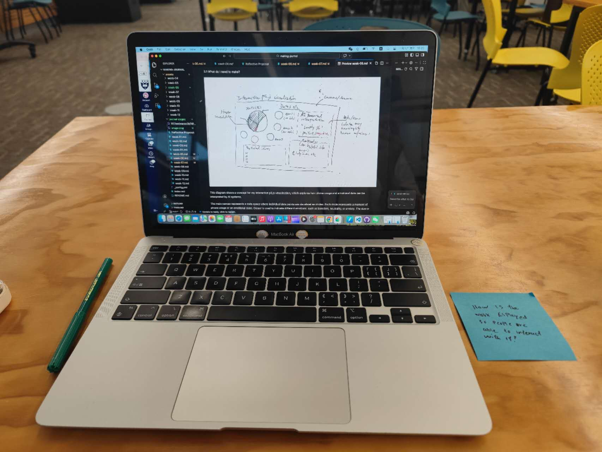
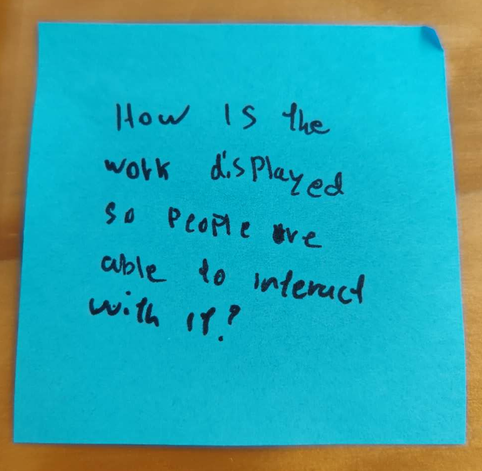
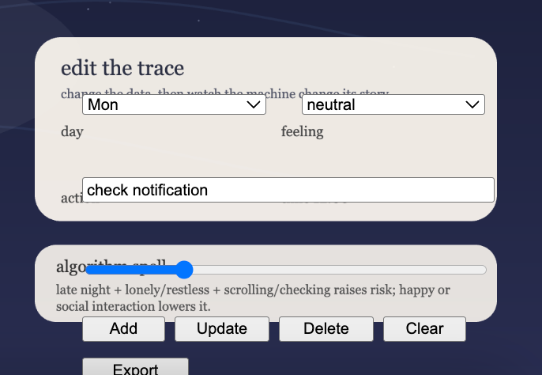
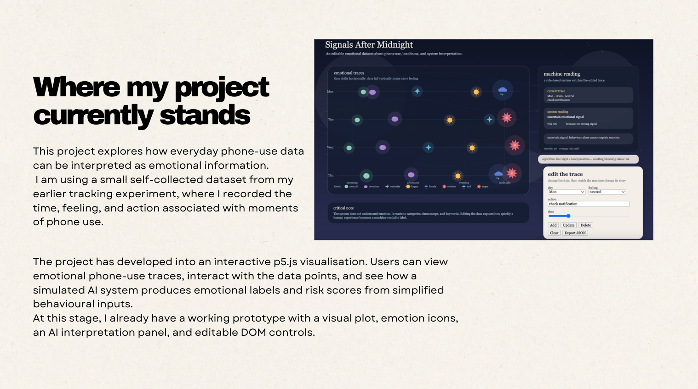
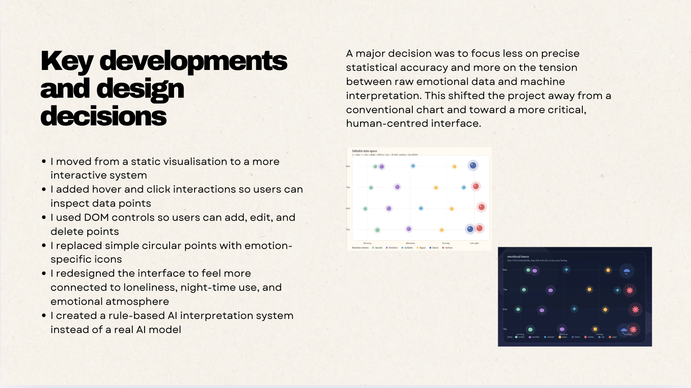
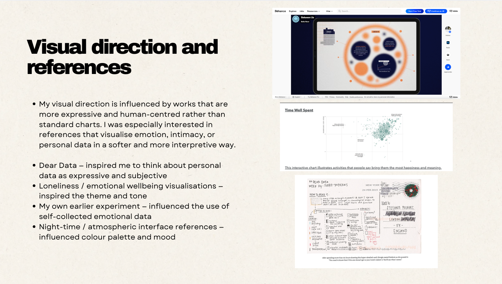
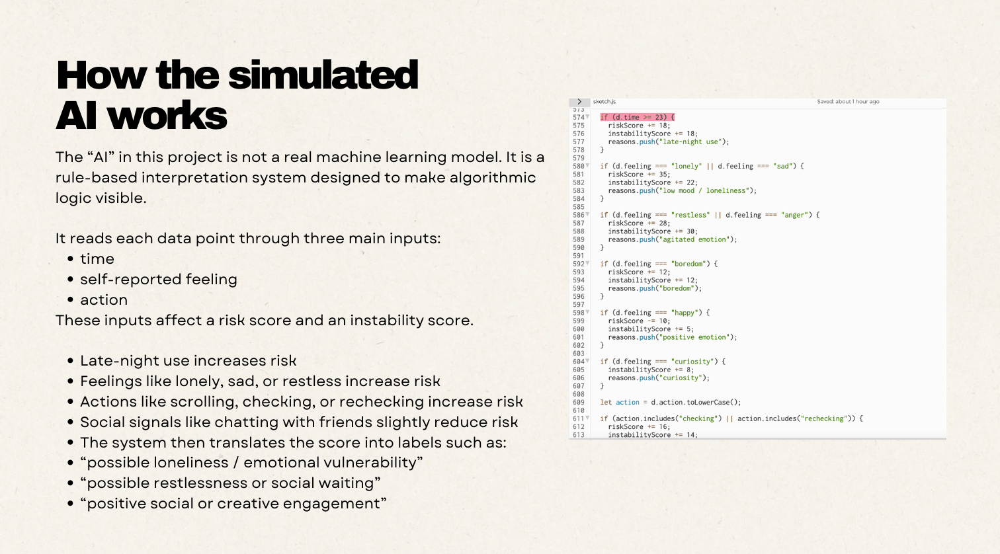
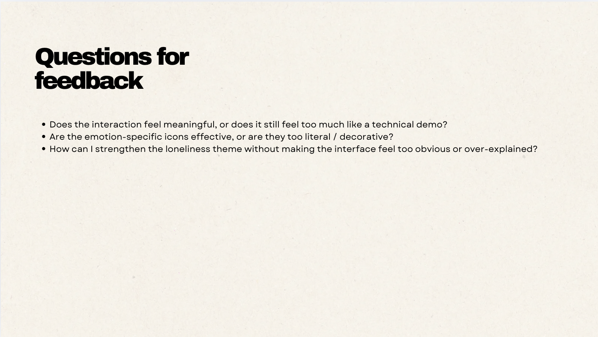

# Week 07

[← Back to Home](../index.md)

## Documentation 
## In-class activities

1. Concept Sketches 

*Develope concept sketch further, using drawing and annotation, and display your sketch on your laptop screen or as a physical print/drawing. Circulate the room and leave post-it note responses on each other's work. Return to your own sketch and read through the responses you've received. Make notes on the comments: what surprised you, what aligned with your ideas, and what you want to follow up on. Redraw or revise your sketch, using the responses to evolve your ideas. Document these developments for your journal entry.*

Today we shared our sketch to the class, there were some really inspiring ideas. some people are doing physical visualisation, which is very cool

I've been thinking for the whole week, now I figure the opening sentence of my project statement is going to be: This project explores how everyday phone-use data can be used, or misused, to infer loneliness and emotional wellbeing.



My sketch presented the basic structure of my interactive p5.js visualisation: a data space with emotional phone-use points, an AI interpretation panel, and a DOM editing area where users can change the data.

One piece of feedback I received was: “How is the work displayed so people are able to interact with it?” This made me realise that my earlier idea of interaction was still too passive. At first, I thought interaction could simply mean hovering over points or clicking to show more information. However, this feedback helped me understand that interaction could go further: the audience could actively participate in the dataset by adding, editing, or deleting data points.

This changed my direction slightly. Instead of only showing a fixed dataset, I started thinking about the visualisation as a small interactive system where users can manipulate the data themselves. This connects more strongly to my project concept, because I am questioning how AI-style interpretation depends on input data and simplified rules. If the audience can change the emotion, time, or action attached to a data point, they can immediately see how the system’s interpretation changes.

Based on this feedback, I revised my plan to include more DOM features in the prototype. These include controls for selecting the day, changing the emotional category, adjusting the time, typing or editing the action, and buttons to add, update, delete, or export data. This would make the interaction more visible and gives the audience more agency.




*I re-thinked about this question seriously. I think interaction is let the audiance participate in your dataset, or can manipulate the dataset using DOM features eg*
```
if (mouseIsPressed) {
  showAI = !showAI;
}
```
*so I will continue along this idea.*


2. Making Sprint (45 mins)

*Using rapid prototyping — short cycles of iteration, focused making, and an experimental mindset — spend 45 minutes producing your first hands-on experiment with your dataset and visualisation approach. Make something visible from your data, however rough. The goal is a testable thing, not a finished outcome.*


I will make a rough p5.js prototype where each phone-use record becomes a coloured data point, and hovering reveals the raw data and possible AI interpretation.

<iframe 
  src="https://editor.p5js.org/eren841/full/yNz8FNJ2f"
  width="1320"
  height="820">
</iframe>

The goal was not to create a finished final outcome, but to make something visible and testable from my dataset.

In this prototype, each data point represents one phone-use moment. The horizontal position shows the time of day, while the vertical position shows the day of recording. I first used coloured circular “jelly” points to represent different emotional categories, such as neutral, boredom, curiosity, happy, lonely, and restless. Later, I began testing emotion-specific icons, such as a sun for happiness, a rain cloud for sadness/loneliness, and a spiky shape for anger or restlessness.

The main technical focus of this sprint was interaction. I tested hover interaction so that when the user moves their mouse over a data point, the prototype reveals the raw data, including the day, time, feeling, and action. This helped me understand how interaction can reveal different layers of information without overcrowding the visualisation.

I also developed a simulated AI interpretation system. Instead of using a real AI model, I created a rule-based interpretation in p5.js. For example, late-night use, repeated checking, scrolling, and lonely or restless feelings increase the risk score, while happy feelings or social interaction reduce it slightly. This allowed the prototype to generate simplified system readings such as “possible loneliness / emotional vulnerability” or “positive social or creative engagement.”


3. 'What if' Variations (45 mins)

*In pairs, share the outcome of your Making Sprint. Walk your partner through what you made, what you were trying to achieve, and where you ended up. Your partner will then propose three 'what if' variations: alternative and provocative directions your project could take. The aim is to encourage critical, speculative, and experimental thinking. Choose one of the variations your partner proposed and produce a drawing or plan that explores this direction. Include notes and annotations to explain how it differs from your current approach and what it might open up for your project.*


One question I received was: what if the icons/data points could have different shapes instead of all being the same?
Currently, I have been representing all data points as similar “jelly-like” circles, mainly differentiated by colour. This made me realise that although colour encodes emotion, the visual language is still quite uniform and may not communicate emotional differences strongly enough.

In response to this, I began exploring the idea of using different shapes to represent different emotions. For example, happiness could be visualised as a small sun, anger or restlessness as a spiky shape, and sadness or loneliness as a rain cloud. This shift moves the visualisation from a more abstract data plot towards a more expressive and symbolic representation. It also aligns better with my intention to make emotional data feel more human and relatable, rather than purely numerical.

Another question I received was: what if a person has “too much” social interaction (e.g. excessive social media use)?
This made me think beyond the simple assumption that more interaction is always positive. In my current AI interpretation logic, social interaction (such as chatting with friends) tends to reduce the “risk score”. However, this feedback highlights that extremes in either direction (too little or too much interaction) could be meaningful. For example, excessive scrolling or constant messaging might also relate to anxiety, dependency, or avoidance behaviour.

Based on this, I started to consider a new direction where the system does not simply categorise behaviour as “positive” or “negative”, but instead recognises imbalance or intensity. This could be reflected visually through increased movement, distortion, or instability in the data points, rather than just changing labels.

<iframe 
  src="https://editor.p5js.org/eren841/full/ETj9RlviJ"
  width="1320"
  height="820">
</iframe>


## Independent Study

1. Project Development & Skill Building

Initially my visualisation was mostly static. Through experimentation with p5.js DOM features such as sliders, dropdown menus, and editable inputs, I began exploring interaction as audience participation rather than passive viewing. Initially my DOM section was a mess, then I learned to make it a HTML card which made the visualisation much better. And I thought about the experiment we did before for the DOM visualisation and interaction, so I add more buttons to let user interact and manipulate the data easier.


*before*

<iframe 
  src="https://editor.p5js.org/eren841/full/4wbZghUyu"
  width="1320"
  height="820">
</iframe>

*after*

```
emotionSelect = createSelect();
emotionSelect.option("happy");
emotionSelect.option("sad");
```

And I followed the idea from peer's feedback to make emotion-specific icons so the feelings can be visually distinct and more expressive

```
if (emotion === "happy") {
  drawSun(x, y);
}
```

Through building the interpretation system, I became more aware that AI systems often simplify emotional behaviour into categories or scores. This shifted my project from simple tracking toward questioning how emotional data is interpreted. This is one of the algorithm that I made for generating outcomes.

The “AI interpretation” in this prototype is a simulated, rule-based system rather than a real machine learning model (I can't really make a magical AI into my p5js so I made an algorithm to simulate it). I designed it this way because the project is not trying to accurately diagnose emotion. Instead, it is trying to make the logic of data interpretation visible. By using simple rules, the audience can see how the system produces emotional labels from behavioural data.

The algorithm reads each data point through three main inputs: time, self-reported feeling, and action. Each input affects a risk score and an instability score. For example, late-night phone use increases the risk score because the system treats midnight use as a possible sign of emotional vulnerability. Feelings such as lonely, sad, restless, or anger increase the score further, while happy feelings or social interaction reduce the score slightly.

The action field also changes the interpretation. Words such as “scrolling,” “checking,” or “rechecking” increase the risk score because the system reads them as repetitive or passive behaviours. In contrast, words such as “chat” or “friends” reduce the score because they suggest social connection. However, this is intentionally simplistic. For example, late-night scrolling may be a sign of loneliness, but it could also be entertainment, study, habit, or comfort.

After calculating the score, the system generates a label such as “possible loneliness / emotional vulnerability,” “possible restlessness or social waiting,” or “positive social or creative engagement.” It also provides a short reason, showing which rules were triggered. This is important because it makes the system’s assumptions visible rather than hiding them behind a black-box AI interface.

Algorithm logic:

1. Time
Late-night use after 23:00 increases the risk score because the system treats this as a possible sign of vulnerability.

2. Feeling
Lonely, sad, restless, and anger increase the score. Happy decreases the score slightly. Curiosity mainly increases instability rather than risk.

3. Action
Scrolling, checking, and rechecking increase risk because the system reads them as repetitive or passive behaviours. Chatting with friends decreases risk because it suggests social connection.

4. Output
The final score is translated into a simplified label, such as possible loneliness, restlessness, or positive engagement.

5. Critical limitation
The system only reads categories and keywords. It does not understand context, personal meaning, or lived experience.

Key code used:

```
if (d.time >= 23) {
  riskScore += 18;
  instabilityScore += 18;
  reasons.push("late-night use");
}

if (d.feeling === "lonely" || d.feeling === "sad") {
  riskScore += 35;
  instabilityScore += 22;
  reasons.push("low mood / loneliness");
}

if (action.includes("checking") || action.includes("rechecking")) {
  riskScore += 16;
  instabilityScore += 14;
  reasons.push("repeated checking");
}

if (action.includes("chat") || action.includes("friends")) {
  riskScore -= 8;
  reasons.push("social interaction");
}
```
This code shows how the simulated AI assigns emotional meaning to behavioural signals. The numbers are not objective truth; they are design choices that reveal how interpretation can be constructed.

This algorithm helped me develop the critical focus of the project. By allowing users to edit the data through DOM controls, they can see how small changes in input can quickly change the system’s interpretation. This demonstrates that AI-style emotional interpretation is not neutral or fixed. It depends on what categories are collected, what meanings are assigned to them, and what rules are built into the system.


2. Progress Report








## AI Usage Statement

I used AI tools (ChatGPT) to support my coding and writing process, including understanding APIs, debugging, and refining ideas. The AI provided guidance and suggestions, but all final design decisions, mappings, and interpretations were developed and evaluated by myself. AI was used as a support and learning tool rather than generating the final work.

### AI tool reference

OpenAI. (2024). ChatGPT (GPT-5) [Large language model]. https://chat.openai.com
