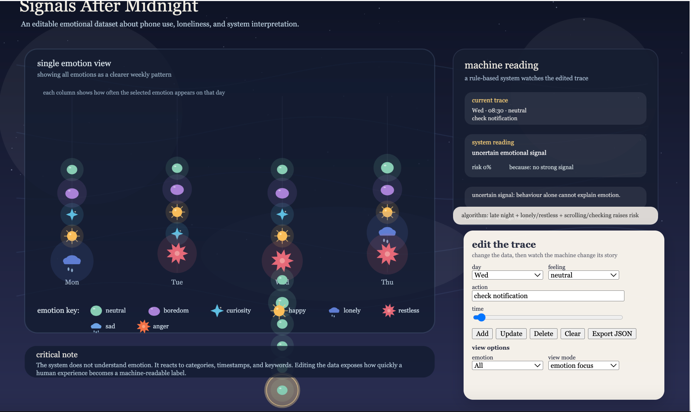

# Week 08

[← Back to Home](../index.md)

## Documentation 

## In-Class Activities
1. Progress Reports

For this activity, I presented my progress report slideshow to a small peer group. My project is currently titled Signals After Midnight, and it explores how phone-use and emotion data can be interpreted through a simulated AI system. I explained that my project uses self-collected data from my earlier phone-feeling tracking experiment, where I recorded moments of phone use through time, action, and feeling. The current prototype is an interactive p5.js visualisation with emotional data points, a DOM editor, emotion-specific icons, and a rule-based AI interpretation panel.

Before presenting, I prepared several feedback questions for my group. I asked whether the interaction felt meaningful or too technical, whether the emotion icons were effective, and how I could strengthen the loneliness theme without making it too obvious or over-explained.

The feedback I received was very useful. One comment was that the emotion key / legend was too small, which made it difficult to understand which icon or colour represented each feeling. Another comment was that the project was actually not over-explained enough. I had been worried about adding too much explanation, but the feedback showed me that viewers still needed clearer guidance about how to read the graph and what the AI interpretation was doing.

My tutor also suggested that the current overview graph, which shows all emotions and all days together, could be hard to read at first. She was interested in the idea of a view where users could select one emotion and see how it appears across the week, such as Monday to Friday. This feedback helped me realise that my visualisation needs to balance two different ways of reading the data: an overall emotional landscape and a clearer focused view.

In response, I decided to keep the original overview graph, but add an emotion filter and a view mode selector. This means users can still see the full dataset, but they can also isolate a single emotion and understand its weekly pattern more clearly. I also enlarged the emotion key to improve readability.

2. Critical Design Propositions

For the second activity, I paired with a student from a different group and briefly explained my project and the feedback I had received. I described my current direction as an interactive emotional data visualisation that questions how AI-style systems interpret phone-use behaviour as loneliness, restlessness, or emotional vulnerability.

The most useful part of this activity was thinking about how the project could communicate its future scenario and critical message more clearly. My current prototype already allows users to edit the dataset and see how the system’s interpretation changes, but the feedback made me think more about how the work could guide audiences through this interaction. If viewers do not understand what they are changing or why it matters, the interaction may become only technical rather than meaningful.

A possible design proposition for my own project is to create a clearer two-mode structure. The first mode would be an overview mode, showing all emotional traces across the week. This gives viewers a sense of the full dataset and its complexity. The second mode would be an emotion focus mode, where users select one feeling, such as loneliness, happiness, boredom, or restlessness, and the graph reorganises itself to show how often that feeling appears across different days.

This proposition adds clarity without removing complexity. It allows the audience to move between a broad emotional landscape and a more focused reading. It also strengthens the intended impact of the project because it shows that data is not neutral: the same dataset can reveal different meanings depending on how the interface organises it.

I also considered how the AI interpretation could be communicated more powerfully. Rather than presenting the AI reading as an objective result, I want to make the system’s assumptions visible. For example, the interface can show that late-night scrolling, repeated checking, and lonely or restless feelings increase the risk score. This helps viewers understand that the system is not truly “understanding” emotion; it is reacting to categories, timestamps, and keywords.

### Reflection

This week’s in-class activities helped me understand that interaction should not only allow users to manipulate data, but should also help them read and interpret the project more clearly. The feedback showed me that my prototype had strong conceptual potential, but needed better guidance for viewers. As a result, my next development steps are to enlarge the legend, add clearer explanatory text, and create an emotion filter / view mode system.

This moves my project forward because it directly responds to critique while keeping the main concept intact. Instead of simplifying the project into only one graph, I am adding multiple ways of reading the same dataset. This supports my larger critical question: how does the way data is organised affect what emotional patterns become visible?

## Independent Study

### Reflective Summary

In my progress report, the most significant feedback I received was about clarity and readability. Although my project already had a working interactive prototype, some parts of the visualisation were still difficult to read. In particular, the legend was too small, which made the emotional colour coding less accessible. I also received feedback that the project was not over-explained; instead, it could benefit from more explanation so that viewers can better understand how to read the graph and what the simulated AI interpretation is doing.

Another important point came from my tutor, who responded positively to the idea of showing a single emotion across the week rather than only showing all emotions mixed together in one overall graph. She suggested that a more focused display could make patterns easier to understand. I found this feedback useful because it highlighted a tension in my project between overview and readability. My current graph shows the full emotional dataset at once, which supports complexity, but it can also become visually confusing.

In response, I have decided not to remove my current graph, but to extend the project by adding another layer of interaction. I want to keep the original all-emotion overview, while also introducing a feature that allows users to select one emotion and isolate it. This could either work as a filter, where only one emotion remains visible in the graph, or as an alternative graph mode in which emotion becomes the main organising structure and day becomes secondary. This would allow viewers to see how often a specific feeling appears across Monday to Friday.

Going forward, I will focus on improving the clarity of the interface by enlarging the legend, adding slightly more explanation, and developing a second readable view. These changes help move the project forward by making it more legible, more interactive, and more responsive to different ways of reading emotional data.

<iframe 
  src="https://editor.p5js.org/eren841/full/aHBhjSA62"
  width="1320"
  height="820">
</iframe>

### Project Development

#### What I changed
increased the size of the legend
improved the explanatory text
began developing an emotion filter / alternative graph mode
tested how to display one emotion across the week more clearly
fixing bugs on the new display version

*Those bugs......*

#### What I tried

I experimented with the idea of keeping the original overview while adding a second way of reading the data. Instead of forcing one fixed view, I explored how the interface could support both a full emotional landscape and a more focused emotion-specific reading. This involved thinking about new interaction options, such as a dropdown menu or a graph mode toggle.

#### What I learnt

Through this process, I learned that interaction can also support clarity, not just participation. Earlier, I mainly used interaction to let viewers edit or manipulate the data. In this development stage, I started to understand that interaction can also help structure the reading experience by allowing users to move between a broad overview and a more focused view.

#### How this moved the project forward

This development helped me move the project from a visually interesting prototype toward a more readable and communicative artefact. It also strengthened the conceptual side of the work, because it acknowledges that emotional data can be read in multiple ways and that interface design shapes what patterns become visible.

## AI Usage Statement

I used AI tools (ChatGPT) to support my coding and writing process, including understanding APIs, debugging, and refining ideas. The AI provided guidance and suggestions, but all final design decisions, mappings, and interpretations were developed and evaluated by myself. AI was used as a support and learning tool rather than generating the final work.

### AI tool reference

OpenAI. (2024). ChatGPT (GPT-5) [Large language model]. https://chat.openai.com
