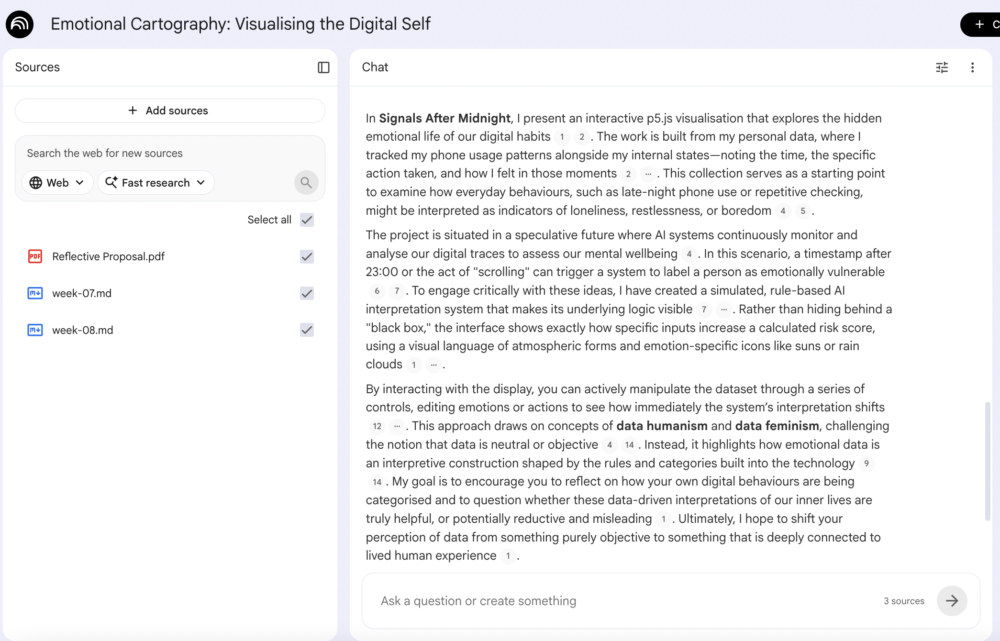

# Week 09

[← Back to Home](../index.md)

## In-Class Activities
In the second phase of the course, which focuses on the Data-Driven Visualisation project, you will continue documenting your work on your GitHub Pages website. This includes recording experiments, technical learning, conceptual development, and engagement with peer critique and exchange activities. Journal entries for weeks 6–12 will be assessed as your process documentation for the project.

It is important to complete all in-class activities (this is still the case if you are absent for a class). Include documentation of these activities in your journal entries, along with the independent study tasks.

1. Project Statement: First Draft

Case Study
Working in pairs, open the Miro boardLinks to an external site. and engage with the Xeno Computer 0.1: Labor case study by Tega Brain and Sam Lavigne. Using the sticky notes, respond to the following:

What are the data sources used in this work?
What is the future scenario it addresses?
What does the statement argue about data and power?
What might be the intended impact, and is this included in the statement?
Drafting with NotebookLM
Open NotebookLMLinks to an external site. and create a new notebook. Add the following as sources:



The draft captured the overall conceptual direction of my project quite well. It identified key ideas such as personal data collection, emotional interpretation, data humanism, data feminism, digital traces, and AI systems. It also outlined the future scenario clearly, where AI systems may monitor phone-use behaviour and interpret it as evidence of mental wellbeing.

What worked well is that the draft made my project sound more coherent and helped me connect my practical prototype to bigger themes such as algorithmic interpretation and data surveillance. It also explained the possible impact of the work: encouraging viewers to question whether data-driven interpretations of emotion are helpful, reductive, or misleading.

However, the draft was still quite general and slightly AI-like in its language. It did not include enough specific technical detail about my actual prototype, such as the p5.js interface, DOM editor, emotion filter, view mode selector, enlarged legend, emotion icons, or the rule-based AI scoring logic. It also described the project in a polished way, but did not fully reflect the messy iterative process behind the work.

To support the project further, I need to research psychological and AI-related interpretations of phone-use behaviour, especially how digital behaviour is sometimes connected to loneliness, restlessness, or mental wellbeing. This will help me make the simulated AI system more critically grounded rather than relying only on my own assumptions.

I will develop Signals After Midnight as an editable p5.js visualisation that uses self-collected phone-use and emotion data to reveal how AI-style systems translate complex emotional experience into simplified behavioural labels.


#### Evaluation
Read through your draft and make notes in response to the following:

What is working well?
What is missing or underdeveloped?
What feels overly generalised or AI-like?
What do you need to research further?
Write one sentence that commits to the direction of your project.
Peer Share
Share your draft and evaluation notes with a peer. Take turns (5 minutes each) and ask your partner to respond:

What is clear and compelling?
What still needs to be developed or resolved?

2. Making Sprint

*Before beginning, take 10 minutes to plan your sprint. Draw on your draft project statement and the feedback you received. Identify what your project most needs right now: what will you develop and test? Set specific goals and consider what tools and materials you will need. Use the next 35 minutes to make focused progress on your project. Work towards your specific goals. The aim is to produce a testable thing, not a finished outcome. Address the challenges most relevant to your current direction, and collect documentation for your journal as you go.*

*For this sprint, my project most needs clearer guidance for viewers. And I want more data, because only 4 days can't tell much. The prototype already includes interaction, emotion icons, an editable dataset, and a simulated AI interpretation system, but the feedback showed that some viewers still need more explanation to understand how to read and use the work.

I will try to make the icons same size, because diffrent size representing the risk is taken too much space and not nessesary. I will develop the project by improving the interface clarity rather than adding many new functions. My main goals are to add a short “how to read this” guide, make the emotion focus view clearer, enlarge or refine the emotion key, and make the AI interpretation more explicitly critical by reminding viewers that it is a rule-based reading, not a diagnosis.

Through making, I want to test whether these changes help the audience understand the relationship between data input and machine interpretation, and make the reprensentation more clear. I also want to see whether the single-emotion view makes weekly emotional patterns easier to read than the full overview graph.

<iframe 
  src="https://editor.p5js.org/eren841/full/e-3Qr6bGv"
  width="1320"
  height="820">
</iframe>

```
if (viewMode === "overview") {
  x = map(d.time, 8, 25, plotX + 62, plotX + plotW - 55);
  baseY = map(dayIndex, 0, max(days.length - 1, 1), plotY + 84, plotY + plotH - 165);
} else {
  x = map(dayIndex, 0, max(days.length - 1, 1), plotX + 68, plotX + plotW - 68);

  let visibleIndex = getVisibleIndexInDay(i, selectedEmotion);
  let visibleCount = getVisibleCountInDay(d.day, selectedEmotion);

  let stackGap = 28;
  let centerY = plotY + plotH / 2;
  let stackOffset = (visibleIndex - (visibleCount - 1) / 2) * stackGap;

  baseY = centerY + stackOffset;
}
```

*This code creates two different ways of reading the same dataset. The overview mode places traces by time and day, while the emotion focus mode reorganises the data by day so viewers can see how one selected emotion appears across two weeks. This directly responds to critique that the original graph was visually interesting but not always easy to read.*

3. Round Robin Rapid Reactions

The class divides into two groups: Presenters and Visitors.

Presenters set up at a fixed station with their project statement draft and making sprint outcome ready to show (e.g. in separate browser tabs, windows, desktop workspaces, or on a Miro board). Visitors circulate, spending time with each presenter before moving on. After 20 minutes, roles swap.

Visitors: use the following prompts to guide the conversation:

Does the project statement clearly outline a provocation?
What does the sprint outcome suggest about where the project is heading?
What does this work make you think or feel about its subject matter?
What needs to be resolved before the week 12 showcase?
Presenters: note down reactions and questions/ideas, and add these to your journal entry.

## Independent Study
The workload expectations for this course include 9.5 hours per week of independent study (outside of class time). As a general guide, you should spend 2 hours reading and thinking about content, and 7.5 hours of work on assignments.

Make sure to complete all of the in-class activities first, before moving on to the independent study tasks.

1. Project Development

Continue developing your project, building directly on the outcomes of this week's Making Sprint and the reactions you received during the Round Robin Rapid Reactions. Refine your project statement alongside your making. Document your progress, including both textual and visual evidence. Reflect on what you tried, what you learnt, and how this has moved your project forward.

I expanded the sample dataset from four days to two weeks to test whether the visualisation still works with a denser emotional dataset. To make the graph more readable, I reduced the icon size and made all data points the same size, so the focus shifts from risk-score scale to weekly emotional patterns. This helped me test the scalability of the interface.

I rethinked about my central idea of imagining "a future where AI systems monitor mental health, prompting the audience to consider the ethics of digital surveillance and data control. Ultimately, the artist aims to challenge the perceived neutrality of data, encouraging viewers to question how algorithmic interpretations shape their self-understanding." This is not a mental health tool.
It is a speculative interface that shows how emotional data might be interpreted by a monitoring system.
The interaction lets viewers experience how easily a small behaviour becomes an algorithmic judgement.

The project is called *Signals After Midnight*. It imagines a future where AI systems monitor everyday digital behaviour as mental health data. The interface uses my self-collected phone-use and emotion data, but the purpose is not to diagnose loneliness or wellbeing. Instead, I want to show how ordinary behaviours, like late-night scrolling, repeated checking, or chatting, can be translated into machine-readable emotional labels.

In the prototype, viewers can click, filter, and edit data points. When the data changes, the machine reading also changes. This is important because it shows that the interpretation is not neutral. It depends on categories, timestamps, keywords, and rules that someone designed.

So the project asks: if an AI system labels my behaviour as lonely, restless, or vulnerable, how much of that is real understanding, and how much is just a constructed interpretation? I want the audience to question how digital surveillance and algorithmic interpretation might shape the way we understand ourselves.

I also noticed that the card's colour is not consistant with the other part, so I will change it.

```
let category = "uncertain";

if (riskScore >= 65 && (d.feeling === "lonely" || d.feeling === "sad")) {
  category = "high loneliness";
} else if (riskScore >= 50) {
  category = "risk";
} else if (d.feeling === "happy" || action.includes("chat") || action.includes("friends")) {
  category = "positive";
} else if (d.feeling === "curiosity") {
  category = "curiosity";
} else if (d.feeling === "boredom") {
  category = "low energy";
}

return { label, riskScore, instabilityScore, reason: reasonText, category };
```

*This code shows how I developed the AI reading into different interpretation categories. Instead of only showing a risk score, the system now classifies traces as high loneliness, risk, positive, curiosity, low energy, or uncertain. This makes the interpretation easier for viewers to understand, while still showing that these categories are designed rules rather than objective truth.*

```
function getReadingTheme(ai) {
  if (ai.category === "high loneliness") {
    return {
      name: "high loneliness signal",
      glow: [120, 150, 230],
      stroke: [170, 190, 255],
      text: [205, 218, 255]
    };
  }

  if (ai.category === "positive") {
    return {
      name: "positive connection signal",
      glow: [240, 190, 105],
      stroke: [255, 220, 150],
      text: [255, 226, 170]
    };
  }

  return {
    name: "uncertain emotional signal",
    glow: [150, 170, 190],
    stroke: [170, 190, 210],
    text: [210, 225, 235]
  };
}
```

*I used soft colour themes to make the AI reading more visible without using harsh warning colours. For example, high loneliness uses a cool blue-purple glow, while positive connection uses a warmer glow. This helped the AI panel become more expressive and visually integrated with the emotional theme of the project.*


2. Progress Report

Prepare a short, 5-minute progress report to share with a small group in next week's class. This should take the form of a simple slideshow (around 5 slides), covering:

where your project currently stands
your current draft project statement
key developments and decisions since Week 8
visual research/references
two or three specific questions you want feedback on
Come to class ready to present and to receive feedback from peers and teachers.


<iframe 
  src="https://editor.p5js.org/eren841/full/lEXoO3UxD"
  width="1320"
  height="820">
</iframe>

*I refined the interface to better match the visual atmosphere of the project. The DOM editor was redesigned from a default white browser panel into a dark themed control card, with softer borders, glowing buttons, and a blue-toned slider. This makes the interaction feel more integrated with the visualisation rather than separate from it. I also moved the average risk text upward so it no longer overlaps with the algorithm note, improving readability. I developed the AI reading panel so that different interpretation categories produce different soft colour glows. This makes the reading result more visible without using harsh warning colours. I also added a burst animation for high loneliness signals, which acts as a visual metaphor for the moment when the system flags a person as emotionally vulnerable. This supports the critical aim of the project: the system’s reading becomes visually powerful, but it is still only a rule-based interpretation, not a diagnosis.*


## AI Usage Statement

I used AI tools (ChatGPT) to support my coding and writing process, including understanding APIs, debugging, and refining ideas. The AI provided guidance and suggestions, but all final design decisions, mappings, and interpretations were developed and evaluated by myself. AI was used as a support and learning tool rather than generating the final work.

### AI tool reference

OpenAI. (2024). ChatGPT (GPT-5) [Large language model]. https://chat.openai.com
