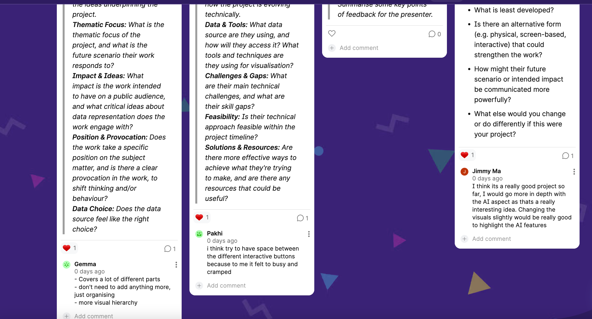

# Week 10

[← Back to Home](../index.md)

## Documentation 

## In-Class Activities

This week I presented my progress report to a small critique group. At this stage, my project had developed into an interactive p5.js visualisation called Signals After Midnight, using my self-recorded phone-use and emotion dataset from Experiment 1. The prototype included two main viewing modes: an overview mode that maps phone-use traces across time and days, and an emotion focus mode that lets viewers isolate one emotion across the week. I also added an editable DOM panel where viewers can change the day, time, feeling, and action of a trace, then observe how the AI reading changes.

The most useful feedback I received was about visual hierarchy and clarity. My classmates and teacher pointed out that the project already contained many strong elements, including the data points, emotion icons, AI reading, editable data panel, and view options, but the layout needed clearer organisation. Some feedback suggested that I did not need to keep adding new features, but should instead make the existing interaction easier to understand. One comment also mentioned that the AI aspect was interesting and should be made more prominent. Another piece of feedback was that the interface felt slightly busy, so the buttons and panels needed more spacing and cleaner arrangement.

From this feedback, I realised that the main issue was not the concept itself, but how the viewer enters the work. If the viewer sees too many explanations or controls at once, they may not know where to look first. Therefore, my next design decision was to simplify the text, strengthen the AI reading panel as the visual focus, and make the interaction panel feel more integrated with the dark visual theme.

### Action Plan

Based on the critique, I identified three main action points for the next iteration:

Improve visual hierarchy by making the AI reading panel larger and more visually prominent.
Simplify explanatory text by removing the visible algorithm statement and reducing long instructions.
Clean up the interface layout by aligning the edit panel with the AI panel, increasing spacing, and moving the emotion key away from the edge of the graph.

I also decided to keep the critical message, but make it shorter. Instead of explaining the full algorithm on screen, I used a small note: “This is not diagnosis. The AI reading reacts to categories, timestamps, and keywords, not lived context.” This keeps the critical idea visible without overwhelming the viewer.


*Feedback I got*

## Independent Study

### Project Development

Based on the feedback, I revised the prototype layout. I removed the separate algorithm bar because it competed with the AI reading panel. I enlarged the “AI reading” title and made the system interpretation text bigger, so the result of the AI interpretation becomes the main focal point on the right side of the screen. I also changed the layout so the “edit the trace” panel aligns with the AI reading panel and sits higher on the canvas. This made the right side feel more intentional and less like separate floating UI pieces.

One important technical change was adjusting the edit panel position and size. This solved the earlier problem where the view options were too close to the edge of the screen.

```
editorPanel.position(870, 445);
editorPanel.size(390, 315);
```

I also made the input controls wider so the interface feels less cramped:
```
daySelect.size(155);
feelingSelect.size(155);
actionInput.size(330);
timeSlider.size(330);
filterSelect.size(155);
viewModeSelect.size(155);
```
I also refined the AI reading panel so different reading categories are communicated through soft colour glows rather than harsh warning colours. For example, high loneliness uses a cool blue-purple glow, while positive connection uses a warmer glow. This makes the AI interpretation easier to notice, while keeping the visual language gentle and atmospheric.

```
if (ai.category === "high loneliness") {
  return {
    name: "high loneliness signal",
    glow: [120, 150, 230],
    stroke: [170, 190, 255],
    text: [205, 218, 255]
  };
}
```

### Reflection

This week helped me understand that interaction is not only about adding more controls. It is also about guiding attention. My earlier version had many interactive parts, but the hierarchy was not clear enough. Through critique, I realised that viewers need to quickly understand what the main action is: click a trace, edit the data, and watch the AI reading change.

The project has now shifted from simply visualising my emotional phone-use data toward questioning how emotional data can be interpreted by a system. The AI reading is intentionally rule-based and limited, which is important to the concept. It can identify patterns from categories, timestamps, and keywords, but it cannot understand the full context of a person’s life. This is why I kept the note that the work is “not diagnosis.” I want the audience to feel both the attraction and discomfort of this kind of interpretation: the system looks clear and confident, but its reading is still incomplete.

For the next step, I want to keep refining the visual balance of the interface and test whether viewers can understand the interaction without me explaining it in person. 


<iframe 
  src="https://editor.p5js.org/eren841/full/CyK2LsjaK"
  width="1320"
  height="820">
</iframe>


## AI Usage Statement

I used AI tools (ChatGPT) to support my coding and writing process, including understanding APIs, debugging, and refining ideas. The AI provided guidance and suggestions, but all final design decisions, mappings, and interpretations were developed and evaluated by myself. AI was used as a support and learning tool rather than generating the final work.

### AI tool reference

OpenAI. (2024). ChatGPT (GPT-5) [Large language model]. https://chat.openai.com
